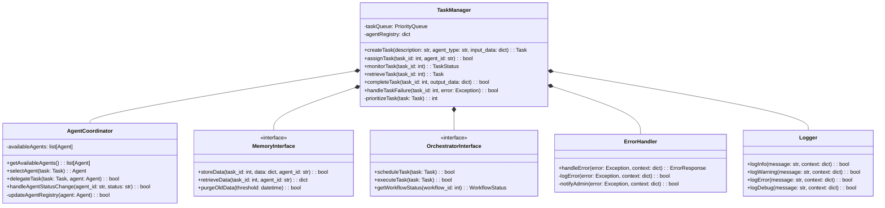

# Improved Core Engine Design Document: TaskMaster AI

## 1. Introduction

This document outlines the design of the Core Engine for TaskMaster AI. The Core Engine serves as the central control unit of the system, coordinating the execution of tasks and managing the interactions between various agent modules, the memory manager, and the orchestrator. It is designed to be modular, scalable, and adaptable for future enhancements.

**Modularity:** The Core Engine is designed with modularity in mind, utilizing separate classes for different functionalities. This approach enhances maintainability, makes it easier to integrate new agent types or features, and promotes code reusability. For example, the use of interfaces for memory and orchestration allows for easy swapping of implementations.

**Scalability:** The architecture supports horizontal scalability, allowing for the addition of resources (e.g., servers, processors) to handle increasing workloads as needed. For instance, the use of a message queue system enables distributed task processing.

**Adaptability:** The Core Engine will utilize design patterns such as the Observer pattern to facilitate adaptation to new AI models and APIs as the system evolves. This allows for easy integration of new functionalities without disrupting existing components.

## 2. Core Engine Responsibilities

* **Task Management:**
    - Receiving and queuing incoming tasks from the API Gateway.
    - Parsing and validating task descriptions using predefined schemas.
    - Determining the most suitable agent for a task based on agent capabilities.
    - Assigning tasks to agents and managing their execution.
    - Monitoring task status and progress.
    - Storing task results and updates in the memory manager.
* **Agent Coordination:**
    - Maintaining a registry of available agents and their capabilities.
    - Communicating with agents via RESTful APIs (as defined in the API Design document).
    - Handling agent availability and status updates.
* **Memory Management:**
    - Managing interactions with the Short-Term and Long-Term Memory components, as defined in the Memory Management Design Document.
* **Orchestration:**
    - Coordinating interactions with the Orchestrator to manage task dependencies, workflow execution, and concurrency control.
* **Task Prioritization:** The Core Engine will implement a mechanism for prioritizing tasks based on factors such as deadlines, task importance, or user-defined preferences. This will involve using a weighted scoring system, where each task is assigned a priority score based on its attributes (e.g., deadline, importance level). Tasks with higher priority scores will be processed first in the task queue.

## 3. Core Engine Class Diagram



**Explanation:**

- **`TaskManager`:** This is the primary class responsible for task management, handling operations like task creation, assignment, monitoring, completion, and error handling. It now includes a method for task prioritization.
- **`AgentCoordinator`:** This class manages the selection and delegation of tasks to agents based on their capabilities. It also communicates with agents via RESTful APIs and monitors agent status.
- **`MemoryInterface`:** This interface defines the methods for interacting with the Short-Term and Long-Term Memory components. The `MemoryManager` class will implement this interface.
- **`OrchestratorInterface`:** This interface defines methods for interacting with the Orchestrator, allowing the Core Engine to manage task dependencies and workflow execution. The `WorkflowManager` class within the Orchestrator will implement this interface.
- **`ErrorHandler`:** This new class is responsible for handling and logging errors, as well as notifying administrators when critical errors occur.
- **`Logger`:** This new class provides a centralized logging mechanism for the Core Engine, allowing for consistent and organized logging across all components.

## 4. Core Engine Data Structures

* **`Task`:**
    - `task_id`: INTEGER (Primary Key) - Unique identifier for each task.
    - `description`: TEXT - Description of the task.
    - `status`: TEXT (e.g., 'created', 'in_progress', 'completed', 'failed') - Current status of the task.
    - `agent_assigned`: TEXT - ID of the agent assigned to the task.
    - `input_data`: TEXT - Input data for the task, potentially in JSON format. This field can store any additional data or context required for the task, such as text documents, code snippets, or data files.
    - `output_data`: TEXT - Output data from the task, potentially in JSON format. This field will store the result of the task execution, which could be a summary, generated code, or any other output produced by the assigned agent.
    - `created_at`: TIMESTAMP - Timestamp indicating when the task was created.
    - `updated_at`: TIMESTAMP - Timestamp indicating when the task was last updated.
    - `priority`: INTEGER - Priority score of the task, used for task queue ordering.
    - `deadline`: TIMESTAMP - Optional deadline for task completion.

* **`Agent`:**
    - `agent_id`: TEXT (Primary Key) - Unique identifier for each agent.
    - `type`: TEXT (e.g., 'nlp', 'technical') - Type of agent.
    - `capabilities`: DICTIONARY - A dictionary mapping capability names to proficiency levels or other metadata. For example, an NLP agent might have capabilities like `{'summarization': 0.9, 'information_extraction': 0.8, 'response_generation': 0.7}`, where the values represent the agent's proficiency level (0.0 to 1.0) for each capability.
    - `status`: TEXT (e.g., 'available', 'busy', 'offline') - Current status of the agent.
    - `last_active`: TIMESTAMP - Timestamp of the agent's last activity.

* **`AgentRegistry`:**
    - A dictionary mapping `agent_id` to `Agent` objects, allowing for quick lookup and management of available agents.

* **`TaskQueue`:**
    - A priority queue data structure that orders tasks based on their priority scores. This ensures that high-priority tasks are processed first.

## 5. Core Engine Algorithms and Logic

### 5.1 Task Queue Management

The Core Engine will use a priority queue data structure (`heapq` in Python) to manage tasks. Tasks will be added to the queue based on their priority scores, which are calculated using the following algorithm:

```python
import heapq

class TaskQueue:
    def __init__(self):
        self.queue = []
    
    def add_task(self, task):
        priority = self.calculate_priority(task)
        heapq.heappush(self.queue, (-priority, task))
    
    def get_next_task(self):
        if self.queue:
            return heapq.heappop(self.queue)[1]
        return None
    
    def calculate_priority(self, task):
        priority = 0
        if task.deadline:
            time_until_deadline = task.deadline - datetime.now()
            priority += max(0, 100 - time_until_deadline.total_seconds() / 3600)  # Higher priority for closer deadlines
        priority += task.priority * 10  # User-defined priority has a significant impact
        return priority
```

### 5.2 Agent Selection

When a new task arrives, the Core Engine will consult the `AgentCoordinator` to select the most suitable agent for the task. This process will involve two steps:

1. **Rule-Based Filtering:** First, apply a set of rules to filter out agents that are not suitable for the task. For example, tasks involving text processing will only consider NLP agents.

2. **Scoring-Based Selection:** Then, use a scoring system to rank the filtered agents based on their capabilities and current status.

```python
class AgentCoordinator:
    def select_agent(self, task):
        suitable_agents = self.filter_agents(task)
        if not suitable_agents:
            raise NoSuitableAgentError("No suitable agent found for the task.")
        
        return max(suitable_agents, key=lambda agent: self.calculate_agent_score(agent, task))
    
    def filter_agents(self, task):
        return [agent for agent in self.available_agents if self.is_agent_suitable(agent, task)]
    
    def is_agent_suitable(self, agent, task):
        # Apply rule-based filtering
        if task.type == 'text_processing' and agent.type != 'nlp':
            return False
        if task.type == 'code_generation' and agent.type != 'technical':
            return False
        return True
    
    def calculate_agent_score(self, agent, task):
        score = 0
        for capability, required_level in task.required_capabilities.items():
            if capability in agent.capabilities:
                score += agent.capabilities[capability] * required_level
        if agent.status == 'available':
            score += 10  # Bonus for immediately available agents
        return score
```

### 5.3 Task Execution

Once an agent is selected, the Core Engine will communicate the task to the agent via a RESTful API call (as defined in the API Design Document). The Core Engine will then:

1. Monitor the task's status.
2. Retrieve updates from the agent, potentially using a mechanism for asynchronous communication (e.g., a message queue).
3. Store task results and updates in the `MemoryManager`.

```python
class TaskManager:
    def execute_task(self, task, agent):
        try:
            self.update_task_status(task, 'in_progress')
            agent_response = self.agent_coordinator.delegate_task(task, agent)
            
            if agent_response.status == 'success':
                self.complete_task(task, agent_response.output)
            else:
                self.handle_task_failure(task, agent_response.error)
        
        except Exception as e:
            self.error_handler.handle_error(e, {'task_id': task.task_id, 'agent_id': agent.agent_id})
    
    def update_task_status(self, task, status):
        task.status = status
        task.updated_at = datetime.now()
        self.memory_interface.store_data(task.task_id, {'status': status}, task.agent_assigned)
    
    def complete_task(self, task, output):
        self.update_task_status(task, 'completed')
        self.memory_interface.store_data(task.task_id, {'output': output}, task.agent_assigned)
    
    def handle_task_failure(self, task, error):
        self.update_task_status(task, 'failed')
        self.error_handler.handle_error(error, {'task_id': task.task_id, 'agent_id': task.agent_assigned})
```

### 5.4 Asynchronous Communication

The Core Engine will handle asynchronous communication to enable concurrent task execution and prevent blocking operations. The primary mechanism for this will be through a message queue. When an agent is assigned a task, the agent will:

- Communicate its status to the Core Engine periodically.
- Use the message queue to notify the Core Engine when a task is complete or if an error occurs.

The Core Engine will use ZeroMQ for the message queue system due to its high performance and ease of integration with Python. The Core Engine will monitor the message queue and respond appropriately to updates from agents.

```python
import zmq

class MessageQueue:
    def __init__(self):
        self.context = zmq.Context()
        self.socket = self.context.socket(zmq.PULL)
        self.socket.bind("tcp://*:5555")
    
    def listen_for_messages(self):
        while True:
            message = self.socket.recv_json()
            self.process_message(message)
    
    def process_message(self, message):
        if message['type'] == 'task_complete':
            self.task_manager.complete_task(message['task_id'], message['output'])
        elif message['type'] == 'task_failed':
            self.task_manager.handle_task_failure(message['task_id'], message['error'])
        elif message['type'] == 'agent_status_update':
            self.agent_coordinator.handle_agent_status_change(message['agent_id'], message['status'])
```

## 6. Memory Management (Interactions)

The Core Engine will interact with the Short-Term and Long-Term Memory components through the `MemoryInterface`. The specific methods of the `MemoryInterface` will allow the Core Engine to store and retrieve data, ensuring that:

* **Short-Term Memory:**
    - The Core Engine can store temporary data that agents might need during task execution (e.g., intermediate calculations, conversational context). This will be implemented using Python's built-in `functools.lru_cache` for simple caching.

* **Long-Term Memory:**
    - The Core Engine can store persistent data, such as task histories, agent knowledge, or user configurations. This will be implemented using SQLite for initial development.
    - The Core Engine will delegate the purging of old or irrelevant data to the `MemoryManager` to ensure efficient storage. A time-based purging mechanism will be implemented to remove memory records older than a configurable threshold (e.g., 30 days). The purging process will involve periodically scanning the long-term memory database and deleting records older than the specified threshold. The threshold can be configured based on the available storage capacity and the expected growth rate of the long-term memory.

```python
from functools import lru_cache
import sqlite3

class MemoryManager(MemoryInterface):
    def __init__(self, db_path, cache_size=1000):
        self.db_path = db_path
        self.conn = sqlite3.connect(db_path)
        self.cursor = self.conn.cursor()
        self.short_term_memory = lru_cache(maxsize=cache_size)(self._get_from_cache)
    
    @lru_cache(maxsize=1000)
    def _get_from_cache(self, key):
        # This method is wrapped with lru_cache for short-term memory
        pass
    
    def store_data(self, task_id, data, agent_id):
        # Store data in short-term memory
        self.short_term_memory(f"{task_id}:{agent_id}", data)
        
        # Store data in long-term memory
        self.cursor.execute("""
            INSERT INTO memory (task_id, agent_id, data, timestamp)
            VALUES (?, ?, ?, datetime('now'))
        """, (task_id, agent_id, json.dumps(data)))
        self.conn.commit()
    
    def retrieve_data(self, task_id, agent_id):
        # Try to retrieve from short-term memory first
        key = f"{task_id}:{agent_id}"
        data = self.short_term_memory(key)
        if data is not None:
            return data
        
        # If not in short-term memory, retrieve from long-term memory
        self.cursor.execute("""
            SELECT data FROM memory
            WHERE task_id = ? AND agent_id = ?
            ORDER BY timestamp DESC LIMIT 1
        """, (task_id, agent_id))
        result = self.cursor.fetchone()
        return json.loads(result[0]) if result else None
    
    def purge_old_data(self, threshold):
        self.cursor.execute("""
            DELETE FROM memory
            WHERE timestamp < datetime('now', ?)
        """, (f"-{threshold} days",))
        self.conn.commit()
```

## 7. Orchestration (Interactions)

The Core Engine interacts with the Orchestrator through the `OrchestratorInterface`. This interface enables the Core Engine to manage workflows and task dependencies. Key interactions include:

* **Task Scheduling:** The Core Engine will use the `OrchestratorInterface` to schedule tasks based on their dependencies, ensuring they are executed in the correct order.
* **Concurrency Control:** The Core Engine can use the `OrchestratorInterface` to implement concurrency control mechanisms (e.g., locks, semaphores) to prevent race conditions and deadlocks when multiple agents access shared resources.

```python
class OrchestratorManager(OrchestratorInterface):
    def __init__(self):
        self.workflow_graph = nx.DiGraph()
        self.semaphores = {}
    
    def schedule_task(self, task):
        self.workflow_graph.add_node(task.task_id, task=task)
        for dependency in task.dependencies:
            self.workflow_graph.add_edge(dependency, task.task_id)
        return self._is_task_ready(task.task_id)
    
    def execute_task(self, task):
        if not self._is_task_ready(task.task_id):
            return False
        
        required_resources = self._get_required_resources(task)
        acquired_semaphores = self._acquire_semaphores(required_resources)
        
        try:
            # Execute the task (this would typically involve agent interaction)
            task.status = 'completed'
            self._update_dependent_tasks(task.task_id)
            return True
        finally:
            self._release_semaphores(acquired_semaphores)
    
    def _is_task_ready(self, task_id):
        return all(self.workflow_graph.nodes[dep]['task'].status == 'completed'
                   for dep in self.workflow_graph.predecessors(task_id))
    
    def _get_required_resources(self, task):
        # This would be implemented based on task requirements
        pass
    
    def _acquire_semaphores(self, resources):
        acquired = []
        try:
            for resource in resources:
                if resource not in self.semaphores:
                    self.semaphores[resource] = threading.Semaphore()
                self.semaphores[resource].acquire()
                acquired.append(resource)
            return acquired
        except:
            self._release_semaphores(acquired)
            raise
    
    def _release_semaphores(self, resources):
        for resource in resources:
            self.semaphores[resource].release()
    
    def _update_dependent_tasks(self, completed_task_id):
        for dependent in self.workflow_graph.successors(completed_task_id):
            if self._is_task_ready(dependent):
                dependent_task = self.workflow_graph.nodes[dependent]['task']
                self.task_manager.execute_task(dependent_task)
```

## 8. Exception Handling

The Core Engine will implement a robust exception handling mechanism to ensure system stability and facilitate debugging.

```python
import logging

class ErrorHandler:
    def __init__(self):
        self.logger = logging.getLogger('CoreEngine')
        self.logger.setLevel(logging.DEBUG)
        handler = logging.FileHandler('core_engine.log')
        formatter = logging.Formatter('%(asctime)s - %(name)s - %(levelname)s - %(message)s')
        handler.setFormatter(formatter)
        self.logger.addHandler(handler)
    
    def handle_error(self, error, context):
        error_id = str(uuid.uuid4())
        self.logger.error(f"Error ID: {error_id} - {str(error)}", exc_info=True, extra=context)
        
        if self._is_critical_error(error):
            self._notify_admin(error_id, error, context)
        
        return ErrorResponse(error_id, str(error), self._get_error_type(error))
    
    def _is_critical_error(self, error):
        # Define criteria for critical errors
        return isinstance(error, (DatabaseConnectionError, AgentCommunicationError))
    
    def _notify_admin(self, error_id, error, context):
        # Implement admin notification (e.g., email, SMS)
        pass
    
    def _get_error_type(self, error):
        return error.__class__.__name__
```

## 9. Performance Considerations

To ensure the Core Engine can handle increasing workloads and maintain performance, the following strategies will be implemented:

1. **Caching:** Implement caching mechanisms for frequently accessed data, such as agent capabilities and recent task results.

2. **Asynchronous Processing:** Utilize asynchronous processing techniques to handle long-running tasks without blocking the main execution thread.

3. **Database Optimization:** Use database indexing and query optimization techniques to improve the performance of database operations.

4. **Load Balancing:** Implement load balancing for incoming requests to distribute the workload across multiple Core Engine instances if needed.

5. **Monitoring and Profiling:** Continuously monitor system performance and resource utilization to identify bottlenecks and optimize accordingly.

```python
class PerformanceMonitor:
    def __init__(self):
        self.metrics = {
            'task_execution_time': [],
            'agent_selection_time': [],
            'memory_access_time': [],
        }
    
    def record_metric(self, metric_name, value):
        self.metrics[metric_name].append(value)
    
    def get_average_metric(self, metric_name):
        values = self.metrics[metric_name]
        return sum(values) / len(values) if values else 0
    
    def generate_performance_report(self):
        report = {metric: self.get_average_metric(metric) for metric in self.metrics}
        # Additional logic to generate a comprehensive performance report
        return report
```

## 10. Future Enhancements

As TaskMaster AI evolves, the Core Engine can be enhanced to support more advanced features and improve overall system performance. Some potential future enhancements include:

1. **Machine Learning-based Task Assignment:** Implement a machine learning model to predict the most suitable agent for a task based on historical performance data.

2. **Dynamic Resource Allocation:** Develop a system for dynamically allocating computational resources to agents based on current workload and task priorities.

3. **Advanced Workflow Management:** Enhance the workflow management capabilities to support more complex, multi-stage tasks with conditional branching and parallel execution.

4. **Natural Language Interface:** Implement a natural language processing component to allow users to interact with the Core Engine using natural language commands.

5. **Predictive Task Scheduling:** Develop a predictive model to anticipate future tasks and pre-allocate resources for improved responsiveness.

6. **Integration with External Services:** Expand the Core Engine's capabilities by integrating with external AI services and APIs for specialized tasks.

## 11. Conclusion

This improved Core Engine Design Document provides a comprehensive blueprint for developing the central control unit of TaskMaster AI. By addressing modularity, scalability, and adaptability, the Core Engine design ensures a robust foundation for the system's growth and evolution.

