# Improved NLP Agent Design Document: TaskMaster AI

## 1. Introduction

This document outlines the design of the NLP Agent for TaskMaster AI. The NLP Agent specializes in Natural Language Processing tasks, leveraging open-source or free AI models. It provides various capabilities such as text summarization, information extraction, response generation, and other language-related functionalities.

## 2. Objectives

- **Functionality:** Implement core NLP functionalities to assist with text-based tasks.
- **Modularity:** Design the agent to be easily extendable with new NLP capabilities.
- **Efficiency:** Ensure efficient processing of NLP tasks to meet performance requirements.
- **Scalability:** Design the agent to handle increasing workloads and adapt to new language models.
- **Maintainability:** Use clear and modular code to facilitate maintenance and future enhancements.

## 3. Core Functionalities

The NLP Agent will provide the following core functionalities:

- **Text Summarization:** Summarizes text, extracting key information.
- **Information Extraction:** Extracts entities, relationships, and facts from unstructured text.
- **Response Generation:** Generates text responses based on input and context.
- **Sentiment Analysis:** Determines the emotional tone or sentiment expressed in text.
- **Intent Classification:** Identifies the purpose or intent behind user queries.
- **Question Answering:** Provides direct answers to user questions based on given text or a knowledge base.

## 4. Additional Capabilities (Future Enhancements)

- **Language Translation:** Translate text between different languages.
- **Named Entity Recognition (NER):** Identify and classify named entities in text.
- **Text Classification:** Categorize text into predefined categories.
- **Semantic Similarity:** Measure the semantic similarity between texts.
- **Dialogue Management:** Handle multi-turn conversations and maintain context.

## 5. Tools and Libraries

- **Groq API:** For accessing models like LLama 3 and Mixtral.
- **OpenRouter AI API:** For accessing models like Toppy.
- **Hugging Face Transformers:** A versatile library providing access to various pre-trained NLP models.
- **spaCy:** An efficient library for NLP tasks, including Named Entity Recognition (NER) and text processing.
- **NLTK (Natural Language Toolkit):** For additional NLP tasks and linguistic data.
- **Sentence-Transformers:** For semantic similarity and sentence embeddings.

## 6. NLP Agent Class Diagram

```mermaid
classDiagram
    NLPAgent <|-- TextSummarizer
    NLPAgent <|-- InformationExtractor
    NLPAgent <|-- ResponseGenerator
    NLPAgent <|-- SentimentAnalyzer
    NLPAgent <|-- IntentClassifier
    NLPAgent <|-- QuestionAnswerer
    NLPAgent --> ModelManager
    NLPAgent --> TextPreprocessor
    
    class NLPAgent {
        +processTask(task: Task) : TaskResult
        -selectModel(task: Task) : Model
        -preprocessText(text: str) : str
        -postprocessResult(result: Any) : TaskResult
    }

    class ModelManager {
        -models: Dict[str, Model]
        +loadModel(model_name: str) : Model
        +unloadModel(model_name: str) : bool
        +getModel(model_name: str) : Model
    }

    class TextPreprocessor {
        +tokenize(text: str) : List[str]
        +removeStopwords(tokens: List[str]) : List[str]
        +lemmatize(tokens: List[str]) : List[str]
    }

    class TextSummarizer {
        +summarize(text: str, max_length: int) : str
    }

    class InformationExtractor {
        +extract(text: str) : Dict[str, Any]
    }

    class ResponseGenerator {
        +generateResponse(input: str, context: str) : str
    }

    class SentimentAnalyzer {
        +analyzeSentiment(text: str) : SentimentScore
    }

    class IntentClassifier {
        +classifyIntent(text: str) : Intent
    }

    class QuestionAnswerer {
        +answerQuestion(question: str, context: str) : str
    }
```



## 7. Data Structures

### 7.1 Task

Represents an NLP task to be processed by the agent.

```python
class Task:
    def __init__(self, task_id: str, task_type: str, input_data: Dict[str, Any], parameters: Dict[str, Any]):
        self.task_id = task_id
        self.task_type = task_type
        self.input_data = input_data
        self.parameters = parameters
```

### 7.2 TaskResult

Represents the result of an NLP task.

```python
class TaskResult:
    def __init__(self, task_id: str, result: Any, metadata: Dict[str, Any]):
        self.task_id = task_id
        self.result = result
        self.metadata = metadata
```

### 7.3 Model

Represents an NLP model used by the agent.

```python
class Model:
    def __init__(self, name: str, type: str, source: str):
        self.name = name
        self.type = type
        self.source = source
        self.model = None  # Will hold the actual model object

    def load(self):
        # Load the model based on its source (e.g., Hugging Face, Groq, OpenRouter)
        pass

    def unload(self):
        # Unload the model to free up resources
        pass

    def predict(self, input_data: Any) -> Any:
        # Make predictions using the model
        pass
```

## 8. Algorithms & Logic

### 8.1 Text Summarization

```python
from transformers import pipeline

class TextSummarizer:
    def __init__(self, model_name='facebook/bart-large-cnn'):
        self.summarizer = pipeline("summarization", model=model_name)

    def summarize(self, text: str, max_length: int = 130, min_length: int = 30) -> str:
        try:
            summary = self.summarizer(text, max_length=max_length, min_length=min_length, do_sample=False)
            return summary[0]['summary_text']
        except Exception as e:
            logging.error(f"Summarization error: {str(e)}")
            return "Error: Unable to generate summary."
```

### 8.2 Information Extraction

```python
import spacy

class InformationExtractor:
    def __init__(self, model_name='en_core_web_sm'):
        self.nlp = spacy.load(model_name)

    def extract(self, text: str) -> Dict[str, Any]:
        try:
            doc = self.nlp(text)
            entities = [(ent.text, ent.label_) for ent in doc.ents]
            noun_phrases = [chunk.text for chunk in doc.noun_chunks]
            return {
                "entities": entities,
                "noun_phrases": noun_phrases,
                "tokens": [token.text for token in doc],
            }
        except Exception as e:
            logging.error(f"Information extraction error: {str(e)}")
            return {"error": "Unable to extract information."}
```

### 8.3 Response Generation

```python
from transformers import pipeline

class ResponseGenerator:
    def __init__(self, model_name='gpt2'):
        self.generator = pipeline("text-generation", model=model_name)

    def generateResponse(self, input_text: str, max_length: int = 100) -> str:
        try:
            response = self.generator(input_text, max_length=max_length, num_return_sequences=1)
            return response[0]['generated_text']
        except Exception as e:
            logging.error(f"Response generation error: {str(e)}")
            return "Error: Unable to generate response."
```

### 8.4 Sentiment Analysis

```python
from transformers import pipeline

class SentimentAnalyzer:
    def __init__(self, model_name='distilbert-base-uncased-finetuned-sst-2-english'):
        self.analyzer = pipeline("sentiment-analysis", model=model_name)

    def analyzeSentiment(self, text: str) -> Dict[str, Any]:
        try:
            sentiment = self.analyzer(text)[0]
            return {
                "label": sentiment['label'],
                "score": sentiment['score']
            }
        except Exception as e:
            logging.error(f"Sentiment analysis error: {str(e)}")
            return {"error": "Unable to analyze sentiment."}
```

### 8.5 Intent Classification

```python
from transformers import pipeline

class IntentClassifier:
    def __init__(self, model_name='facebook/bart-large-mnli'):
        self.classifier = pipeline("zero-shot-classification", model=model_name)

    def classifyIntent(self, text: str, candidate_labels: List[str]) -> Dict[str, Any]:
        try:
            result = self.classifier(text, candidate_labels)
            return {
                "intent": result['labels'][0],
                "score": result['scores'][0]
            }
        except Exception as e:
            logging.error(f"Intent classification error: {str(e)}")
            return {"error": "Unable to classify intent."}
```

### 8.6 Question Answering

```python
from transformers import pipeline

class QuestionAnswerer:
    def __init__(self, model_name='distilbert-base-cased-distilled-squad'):
        self.qa_pipeline = pipeline("question-answering", model=model_name)

    def answerQuestion(self, question: str, context: str) -> Dict[str, Any]:
        try:
            result = self.qa_pipeline(question=question, context=context)
            return {
                "answer": result['answer'],
                "score": result['score']
            }
        except Exception as e:
            logging.error(f"Question answering error: {str(e)}")
            return {"error": "Unable to answer the question."}
```

## 9. Integration with Core Engine

The NLP Agent will integrate with the Core Engine using a well-defined API. This API will allow the Core Engine to send tasks to the NLP Agent and receive results.

```python
class NLPAgentAPI:
    def __init__(self):
        self.text_summarizer = TextSummarizer()
        self.information_extractor = InformationExtractor()
        self.response_generator = ResponseGenerator()
        self.sentiment_analyzer = SentimentAnalyzer()
        self.intent_classifier = IntentClassifier()
        self.question_answerer = QuestionAnswerer()

    def process_task(self, task: Task) -> TaskResult:
        if task.task_type == "summarization":
            result = self.text_summarizer.summarize(task.input_data['text'], **task.parameters)
        elif task.task_type == "information_extraction":
            result = self.information_extractor.extract(task.input_data['text'])
        elif task.task_type == "response_generation":
            result = self.response_generator.generateResponse(task.input_data['text'], **task.parameters)
        elif task.task_type == "sentiment_analysis":
            result = self.sentiment_analyzer.analyzeSentiment(task.input_data['text'])
        elif task.task_type == "intent_classification":
            result = self.intent_classifier.classifyIntent(task.input_data['text'], task.parameters['candidate_labels'])
        elif task.task_type == "question_answering":
            result = self.question_answerer.answerQuestion(task.input_data['question'], task.input_data['context'])
        else:
            result = {"error": "Unsupported task type"}

        return TaskResult(task.task_id, result, {"task_type": task.task_type})
```

## 10. Error Handling and Logging

Implement robust error handling and logging mechanisms to ensure system stability and facilitate debugging.

```python
import logging

class NLPAgentLogger:
    def __init__(self, log_file='nlp_agent.log'):
        self.logger = logging.getLogger('NLPAgent')
        self.logger.setLevel(logging.DEBUG)
        handler = logging.FileHandler(log_file)
        formatter = logging.Formatter('%(asctime)s - %(name)s - %(levelname)s - %(message)s')
        handler.setFormatter(formatter)
        self.logger.addHandler(handler)

    def log_info(self, message):
        self.logger.info(message)

    def log_error(self, message):
        self.logger.error(message)

    def log_warning(self, message):
        self.logger.warning(message)

class NLPAgentErrorHandler:
    def __init__(self, logger):
        self.logger = logger

    def handle_error(self, error, context):
        error_message = f"Error: {str(error)}, Context: {context}"
        self.logger.log_error(error_message)
        return {"error": str(error), "context": context}
```

## 11. Performance Considerations

To ensure the NLP Agent can handle increasing workloads and maintain performance:

1. **Model Caching:** Implement a caching mechanism for frequently used models to reduce load times.
2. **Batching:** Process multiple inputs in batches when possible to improve throughput.
3. **Asynchronous Processing:** Utilize asynchronous processing for non-blocking operations.
4. **Resource Monitoring:** Continuously monitor system resources (CPU, RAM, GPU) and adjust workload accordingly.

```python
class ModelCache:
    def __init__(self, max_size=5):
        self.cache = {}
        self.max_size = max_size

    def get(self, model_name):
        return self.cache.get(model_name)

    def put(self, model_name, model):
        if len(self.cache) >= self.max_size:
            # Implement LRU eviction policy
            lru_model = min(self.cache, key=lambda k: self.cache[k]['last_used'])
            del self.cache[lru_model]
        self.cache[model_name] = {'model': model, 'last_used': time.time()}

class ResourceMonitor:
    def __init__(self):
        self.cpu_usage = psutil.cpu_percent()
        self.ram_usage = psutil.virtual_memory().percent
        self.gpu_usage = self.get_gpu_usage()

    def get_gpu_usage(self):
        # Implement GPU usage monitoring (e.g., using nvidia-smi for NVIDIA GPUs)
        pass

    def is_overloaded(self):
        return self.cpu_usage > 90 or self.ram_usage > 90 or self.gpu_usage > 90

    def update(self):
        self.cpu_usage = psutil.cpu_percent()
        self.ram_usage = psutil.virtual_memory().percent
        self.gpu_usage = self.get_gpu_usage()
```

## 12. Testing Strategy

Implement a comprehensive testing strategy to ensure the reliability and correctness of the NLP Agent:

1. **Unit Testing:** Test individual NLP functions and classes.
2. **Integration Testing:** Test the interaction between the NLP Agent and the Core Engine.
3. **Functional Testing:** Validate the correctness of NLP task results.
4. **Performance Testing:** Evaluate the agent's performance under various workloads.
5. **Error Handling Testing:** Verify proper handling of edge cases and errors.

```python
import unittest
from unittest.mock import Mock, patch

class TestNLPAgent(unittest.TestCase):
    def setUp(self):
        self.nlp_agent = NLPAgentAPI()

    def test_text_summarization(self):
        task = Task("1", "summarization", {"text": "This is a long text that needs to be summarized."}, {})
        result = self.nlp_agent.process_task(task)
        self.assertIsNotNone(result.result)
        self.assertIsInstance(result.result, str)

    def test_sentiment_analysis(self):
        task = Task("2", "sentiment_analysis", {"text": "I love this product!"}, {})
        result = self.nlp_agent.process_task(task)
        self.assertIn("label", result.result)
        self.assertIn("score", result.result)

    @patch('nlp_agent.TextSummarizer.summarize')
    def test_summarization_error_handling(self, mock_summarize):
        mock_summarize.side_effect = Exception("Model error")
        task = Task("3", "summarization", {"text": "Text to summarize"}, {})
        result = self.nlp_agent.process_task(task)
        self.assertIn("error", result.result)

    # Add more test cases for other NLP tasks

if __name__ == '__main__':
    unittest.main()
```

## 13. Security Considerations

Implement security measures to protect the NLP Agent and the data it processes:

1. **Input Sanitization:** Sanitize all input to prevent injection attacks.
2. **Data Encryption:** Encrypt sensitive data in transit and at rest.
3. **Access Control:** Implement proper authentication and authorization for API access.
4. **Model Security:** Ensure that models are securely stored and accessed.
5. **Privacy Compliance:** Adhere to data protection regulations (e.g., GDPR, CCPA).

```python
import re
from cryptography.fernet import Fernet

class SecurityManager:
    def __init__(self):
        self.key = Fernet.generate_key()
        self.cipher_suite = Fernet(self.key)

    def sanitize_input(self, text):
        # Remove any potentially harmful characters or patterns
        sanitized = re.sub(r'[^\w\s]', '', text)
        return sanitized

    def encrypt_data(self, data):
        encrypted_data = self.cipher_suite.encrypt(data.encode())
        return encrypted_data

    def decrypt_data(self, encrypted_data):
        decrypted_data = self.cipher_suite.decrypt(encrypted_data).decode()
        return decrypted_data

class AccessControl:
    def __init__(self):
        self.api_keys = {}  # Store API keys securely in practice

    def authenticate(self, api_key):
        return api_key in self.api_keys

    def authorize(self, api_key, action):
        if not self.authenticate(api_key):
            return False
        # Implement action-based authorization logic
        return True
```

## 14. Scalability

Design the NLP Agent to handle increasing workloads and adapt to growing demands:

1. **Horizontal Scaling:** Allow deployment of multiple NLP Agent instances behind a load balancer.
2. **Vertical Scaling:** Optimize the agent to utilize additional CPU cores and GPU acceleration when available.
3. **Distributed Processing:** Implement distributed processing for large-scale NLP tasks.
4. **Dynamic Resource Allocation:** Allocate resources dynamically based on task complexity and system load.

```python
from multiprocessing import Pool

class ScalableNLPAgent:
    def __init__(self, num_workers=4):
        self.pool = Pool(processes=num_workers)

    def process_batch(self, tasks):
        return self.pool.map(self.process_single_task, tasks)

    def process_single_task(self, task):
        # Implementation of single task processing
        pass

    def scale_up(self, additional_workers):
        self.pool.close()
        self.pool.join()
        self.pool = Pool(processes=self.pool._processes + additional_workers)

    def scale_down(self, reduce_workers):
        new_worker_count = max(1, self.pool._processes - reduce_workers)
        self.pool.close()
        self.pool.join()
        self.pool = Pool(processes=new_worker_count)
```

## 15. Future Enhancements

Outline potential improvements and new features for the NLP Agent:

1. **Multi-language Support:** Extend NLP capabilities to handle multiple languages.
2. **Custom Model Training:** Implement functionality to fine-tune models on domain-specific data.
3. **Advanced NLP Tasks:** Incorporate more advanced NLP tasks such as text generation, machine translation, and text-to-speech conversion.
4. **Continuous Learning:** Develop a mechanism for the agent to learn and improve from user interactions and feedback.
5. **Integration with Knowledge Graphs:** Enhance information extraction and question answering by integrating with knowledge graph technologies.
6. **Explainable AI:** Implement techniques to provide explanations for NLP model decisions and outputs.

```python
class EnhancedNLPAgent(NLPAgentAPI):
    def __init__(self):
        super().__init__()
        self.supported_languages = ['en', 'es', 'fr', 'de']  # Example languages
        self.knowledge_graph = KnowledgeGraph()  # Placeholder for knowledge graph integration

    def process_multilingual_task(self, task: Task) -> TaskResult:
        if task.parameters.get('language') not in self.supported_languages:
            return TaskResult(task.task_id, {"error": "Unsupported language"}, {})
        # Process task with language-specific models
        pass

    def fine_tune_model(self, model_name: str, training_data: List[Dict]):
        # Implement model fine-tuning logic
        pass

    def explain_result(self, task: Task, result: TaskResult) -> Dict:
        # Implement explainability techniques
        pass

class KnowledgeGraph:
    def __init__(self):
        # Initialize knowledge graph
        pass

    def query(self, question: str) -> List[str]:
        # Query knowledge graph
        pass

    def update(self, new_information: Dict):
        # Update knowledge graph with new information
        pass
```

## 16. Conclusion

This improved NLP Agent Design Document provides a comprehensive blueprint for developing a robust, scalable, and efficient natural language processing component for TaskMaster AI. The design addresses key aspects such as core functionalities, integration with the Core Engine, error handling, performance optimization, security, scalability, and future enhancements.

Key improvements in this design include:

1. More detailed class diagrams and data structures
2. Expanded algorithms and logic for various NLP tasks
3. Improved integration details with the Core Engine
4. Comprehensive error handling and logging mechanisms
5. Enhanced security measures
6. Scalability considerations
7. Outlined testing strategy
8. Proposed future enhancements

By following this design and incorporating continuous improvement based on performance metrics and user feedback, the NLP Agent will play a crucial role in enhancing the natural language processing capabilities of TaskMaster AI.