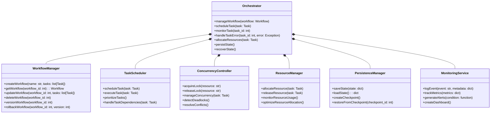

# Orchestrator Design Document: TaskMaster AI

## 1. Introduction

This document outlines the design of the Orchestrator module for TaskMaster AI. The Orchestrator is responsible for managing task dependencies, workflow execution, and concurrency control between agents. It ensures that tasks are executed in the correct order, handles task dependencies, and manages concurrent task execution to prevent conflicts.

## 2. Objectives

- **Task Dependency Management:** Ensure tasks are executed in the correct order based on their dependencies.
- **Workflow Execution:** Manage the execution of workflows, ensuring tasks are completed as per the defined sequence.
- **Concurrency Control:** Prevent conflicts and ensure efficient resource utilization during concurrent task execution.
- **Scalability:** Design the system to handle increasing numbers of tasks and workflows as the system grows.
- **Flexibility:** Allow for easy integration of new task types and workflows.
- **Fault Tolerance:** Implement mechanisms to handle failures and ensure system reliability.
- **Observability:** Provide comprehensive monitoring and logging capabilities.

## 3. Orchestrator Responsibilities

- **Workflow Management:** Define, manage, and version control workflows, ensuring tasks are executed in the correct order.
- **Task Scheduling:** Schedule tasks based on their dependencies, priorities, and available resources.
- **Concurrency Control:** Implement advanced mechanisms to manage concurrent task execution and prevent conflicts.
- **Task Monitoring:** Monitor the status of tasks and workflows, providing detailed updates to the Core Engine.
- **Error Handling:** Handle errors during task execution and ensure workflows can recover or fail gracefully.
- **Resource Management:** Efficiently allocate and manage system resources for task execution.
- **Persistence:** Ensure workflow and task states are persisted for fault tolerance and recovery.

## 4. Orchestrator Class Diagram



## 5. Data Structures

### 5.1 Workflow

Represents a workflow, containing a list of tasks and their dependencies.

```python
class Workflow:
    def __init__(self, workflow_id, name, tasks, status='created', version=1):
        self.workflow_id = workflow_id
        self.name = name
        self.tasks = tasks
        self.status = status
        self.version = version

    def add_task(self, task):
        self.tasks.append(task)

    def remove_task(self, task_id):
        self.tasks = [task for task in self.tasks if task.task_id != task_id]

    def update_status(self, status):
        self.status = status

    def increment_version(self):
        self.version += 1
```

### 5.2 Task

Represents a task within a workflow, including its dependencies, assigned agent, and resource requirements.

```python
class Task:
    def __init__(self, task_id, description, status='created', dependencies=None, agent_assigned=None, input_data=None, output_data=None, priority=0, resource_requirements=None):
        self.task_id = task_id
        self.description = description
        self.status = status
        self.dependencies = dependencies if dependencies else []
        self.agent_assigned = agent_assigned
        self.input_data = input_data
        self.output_data = output_data
        self.priority = priority
        self.resource_requirements = resource_requirements if resource_requirements else {}

    def update_status(self, status):
        self.status = status

    def set_output_data(self, output_data):
        self.output_data = output_data

    def update_priority(self, priority):
        self.priority = priority

    def add_dependency(self, task_id):
        if task_id not in self.dependencies:
            self.dependencies.append(task_id)

    def remove_dependency(self, task_id):
        if task_id in self.dependencies:
            self.dependencies.remove(task_id)
```

## 6. Algorithms & Logic

### 6.1 Workflow Management

The `WorkflowManager` class is responsible for creating, updating, retrieving, and deleting workflows, as well as managing workflow versions.

```python
import networkx as nx

class WorkflowManager:
    def __init__(self):
        self.workflows = {}
        self.version_history = {}

    def createWorkflow(self, name, tasks):
        workflow_id = len(self.workflows) + 1
        workflow = Workflow(workflow_id, name, tasks)
        self.workflows[workflow_id] = workflow
        self.version_history[workflow_id] = [workflow]
        return workflow

    def getWorkflow(self, workflow_id):
        return self.workflows.get(workflow_id)

    def updateWorkflow(self, workflow_id, tasks):
        if workflow_id in self.workflows:
            workflow = self.workflows[workflow_id]
            workflow.tasks = tasks
            workflow.increment_version()
            self.version_history[workflow_id].append(workflow)

    def deleteWorkflow(self, workflow_id):
        if workflow_id in self.workflows:
            del self.workflows[workflow_id]
            del self.version_history[workflow_id]

    def versionWorkflow(self, workflow_id):
        if workflow_id in self.workflows:
            workflow = self.workflows[workflow_id]
            workflow.increment_version()
            self.version_history[workflow_id].append(workflow)

    def rollbackWorkflow(self, workflow_id, version):
        if workflow_id in self.version_history:
            versions = self.version_history[workflow_id]
            if 0 <= version < len(versions):
                self.workflows[workflow_id] = versions[version]

    def validateWorkflow(self, workflow):
        graph = nx.DiGraph()
        for task in workflow.tasks:
            graph.add_node(task.task_id)
            for dep in task.dependencies:
                graph.add_edge(dep, task.task_id)
        return nx.is_directed_acyclic_graph(graph)
```

### 6.2 Task Scheduling

The `TaskScheduler` class is responsible for scheduling and executing tasks based on their dependencies, priorities, and resource availability.

```python
import heapq

class TaskScheduler:
    def __init__(self, resource_manager):
        self.task_queue = []
        self.resource_manager = resource_manager

    def scheduleTask(self, task):
        heapq.heappush(self.task_queue, (-task.priority, task))

    def executeTask(self, task):
        if self.resource_manager.allocateResource(task):
            try:
                task.update_status('in_progress')
                # Simulate task execution
                task.set_output_data({'result': 'Task completed successfully'})
                task.update_status('completed')
            finally:
                self.resource_manager.releaseResource(task)
        else:
            task.update_status('waiting')

    def prioritizeTasks(self):
        self.task_queue.sort(key=lambda x: (-x[0], x[1].task_id))

    def handleTaskDependencies(self, task):
        for dep_id in task.dependencies:
            dep_task = self.getTaskById(dep_id)
            if dep_task.status != 'completed':
                return False
        return True

    def getTaskById(self, task_id):
        for _, task in self.task_queue:
            if task.task_id == task_id:
                return task
        return None
```

### 6.3 Concurrency Control

The `ConcurrencyController` class is responsible for managing concurrent task execution and preventing conflicts.

```python
import threading
from concurrent.futures import ThreadPoolExecutor

class ConcurrencyController:
    def __init__(self, max_workers=10):
        self.locks = {}
        self.lock = threading.Lock()
        self.executor = ThreadPoolExecutor(max_workers=max_workers)

    def acquireLock(self, resource):
        with self.lock:
            if resource not in self.locks:
                self.locks[resource] = threading.Lock()
            return self.locks[resource].acquire(blocking=False)

    def releaseLock(self, resource):
        with self.lock:
            if resource in self.locks:
                self.locks[resource].release()

    def manageConcurrency(self, task):
        future = self.executor.submit(self.executeTask, task)
        return future

    def executeTask(self, task):
        if self.acquireLock(task.agent_assigned):
            try:
                task.update_status('in_progress')
                # Simulate task execution
                task.set_output_data({'result': 'Task completed successfully'})
                task.update_status('completed')
            finally:
                self.releaseLock(task.agent_assigned)
        else:
            task.update_status('waiting')

    def detectDeadlocks(self):
        # Implement deadlock detection algorithm (e.g., wait-for graph)
        pass

    def resolveConflicts(self):
        # Implement conflict resolution strategy (e.g., priority-based preemption)
        pass
```

### 6.4 Resource Management

The `ResourceManager` class is responsible for allocating and managing system resources for task execution.

```python
class ResourceManager:
    def __init__(self, resources):
        self.resources = resources
        self.allocated = {}

    def allocateResource(self, task):
        with threading.Lock():
            for resource, amount in task.resource_requirements.items():
                if self.resources.get(resource, 0) < amount:
                    return False
            for resource, amount in task.resource_requirements.items():
                self.resources[resource] -= amount
                self.allocated.setdefault(task.task_id, {})[resource] = amount
        return True

    def releaseResource(self, task):
        with threading.Lock():
            if task.task_id in self.allocated:
                for resource, amount in self.allocated[task.task_id].items():
                    self.resources[resource] += amount
                del self.allocated[task.task_id]

    def monitorResourceUsage(self):
        # Implement resource usage monitoring
        pass

    def optimizeResourceAllocation(self):
        # Implement resource allocation optimization strategy
        pass
```

### 6.5 Persistence Management

The `PersistenceManager` class is responsible for persisting and recovering system state.

```python
import json
import os

class PersistenceManager:
    def __init__(self, storage_path):
        self.storage_path = storage_path

    def saveState(self, state):
        with open(os.path.join(self.storage_path, 'state.json'), 'w') as f:
            json.dump(state, f)

    def loadState(self):
        try:
            with open(os.path.join(self.storage_path, 'state.json'), 'r') as f:
                return json.load(f)
        except FileNotFoundError:
            return {}

    def createCheckpoint(self, state):
        checkpoint_id = len(os.listdir(self.storage_path))
        with open(os.path.join(self.storage_path, f'checkpoint_{checkpoint_id}.json'), 'w') as f:
            json.dump(state, f)
        return checkpoint_id

    def restoreFromCheckpoint(self, checkpoint_id):
        try:
            with open(os.path.join(self.storage_path, f'checkpoint_{checkpoint_id}.json'), 'r') as f:
                return json.load(f)
        except FileNotFoundError:
            return None
```

## 7. Error Handling and Monitoring

The Orchestrator implements a robust error handling and monitoring mechanism to ensure system stability, facilitate debugging, and provide observability.

### 7.1 Error Logging and Handling

```python
import logging

class ErrorHandler:
    def __init__(self):
        self.logger = logging.getLogger('Orchestrator')
        self.logger.setLevel(logging.DEBUG)
        handler = logging.FileHandler('orchestrator.log')
        formatter = logging.Formatter('%(asctime)s - %(name)s - %(levelname)s - %(message)s')
        handler.setFormatter(formatter)
        self.logger.addHandler(handler)

    def log_error(self, error, task_id=None, workflow_id=None):
        error_msg = f"Error: {str(error)}"
        if task_id:
            error_msg += f" | Task ID: {task_id}"
        if workflow_id:
            error_msg += f" | Workflow ID: {workflow_id}"
        self.logger.error(error_msg)

    def handle_task_error(self, task, error):
        self.log_error(error, task_id=task.task_id)
        task.update_status('failed')
        # Implement error recovery strategy (e.g., retry, skip, or fail workflow)

    def handle_workflow_error(self, workflow, error):
        self.log_error(error, workflow_id=workflow.workflow_id)
        workflow.update_status('failed')
        # Implement workflow-level error recovery strategy
```

### 7.2 Monitoring and Observability

```python
import time
from prometheus_client import start_http_server, Gauge, Counter, Histogram

class MonitoringService:
    def __init__(self, port=8000):
        self.task_gauge = Gauge('tasks_in_progress', 'Number of tasks currently in progress')
        self.workflow_gauge = Gauge('workflows_in_progress', 'Number of workflows currently in progress')
        self.task_counter = Counter('tasks_completed', 'Number of tasks completed')
        self.error_counter = Counter('errors', 'Number of errors encountered')
        self.task_duration = Histogram('task_duration_seconds', 'Task execution duration in seconds')

        start_http_server(port)

    def trackMetrics(self, metrics):
        self.task_gauge.set(metrics['tasks_in_progress'])
        self.workflow_gauge.set(metrics['workflows_in_progress'])
        self.task_counter.inc(metrics['tasks_completed'])
        self.error_counter.inc(metrics['errors'])

    def recordTaskDuration(self, duration):
        self.task_duration.observe(duration)

    def generateAlerts(self, condition):
        # Implement alerting logic based on defined conditions
        pass

    def createDashboard(self):
        # Implement dashboard creation (e.g., using Grafana)
        pass
```

## 8. Scalability and Performance Considerations

To ensure the Orchestrator can handle increasing workloads and maintain performance, the following strategies will be implemented:

1. **Distributed Task Execution:** Implement a distributed task execution system using technologies like Celery or Apache Airflow to distribute tasks across multiple worker nodes.

2. **Caching:** Implement caching mechanisms for frequently accessed data, such as workflow definitions and task statuses, using Redis or Memcached.

3. **Database Optimization:** Use database indexing and query optimization techniques to improve the performance of database operations.

4. **Load Balancing:** Implement load balancing for incoming requests to distribute the workload across multiple Orchestrator instances.

5. **Horizontal Scaling:** Design the system to allow for easy horizontal scaling by adding more Orchestrator instances as needed.

6. **Asynchronous Processing:** Utilize asynchronous processing techniques to handle long-running tasks without blocking the main execution thread.

7. **Performance Monitoring:** Continuously monitor system performance and resource utilization to identify bottlenecks and optimize accordingly.

```python
class PerformanceMonitor:
    def __init__(self):
        self.metrics = {
            'task_execution_time': [],
            'workflow_completion_time': [],
            'resource_utilization': {},
        }

    def record_metric(self, metric_name, value):
        if metric_name in self.metrics:
            self.metrics[metric_name].append(value)
        else:
            self.metrics[metric_name] = [value]

    def get_average_metric(self, metric_name):
        values = self.metrics.get(metric_name, [])
        return sum(values) / len(values) if values else 0

    def generate_performance_report(self):
        report = {
            'avg_task_execution_time': self.get_average_metric('task_execution_time'),
            'avg_workflow_completion_time': self.get_average_metric('workflow_completion_time'),
            'resource_utilization': {res: sum(vals) / len(vals) for res, vals in self.metrics['resource_utilization'].items()},
        }
        return report
```

## 9. Security Considerations

To ensure the security of the Orchestrator and the overall system, the following measures will be implemented:

1. **Authentication and Authorization:** Implement robust authentication and authorization mechanisms to ensure only authorized users and systems can interact with the Orchestrator.

2. **Encryption:** Use encryption for data at rest and in transit to protect sensitive information.

3. **Input Validation:** Implement thorough input validation to prevent injection attacks and other security vulnerabilities.

4. **Audit Logging:** Maintain detailed audit logs of all actions performed by the Orchestrator for security analysis and compliance purposes.

5. **Secure Configuration Management:** Implement secure configuration management practices to protect sensitive configuration data.

6. **Regular Security Updates:** Keep all dependencies and libraries up to date with the latest security patches.

```python
import hashlib
import secrets

class SecurityManager:
    def __init__(self):
        self.salt = secrets.token_bytes(16)

    def hash_password(self, password):
        return hashlib.pbkdf2_hmac('sha256', password.encode(), self.salt, 100000)

    def verify_password(self, stored_password, provided_password):
        return secrets.compare_digest(stored_password, self.hash_password(provided_password))

    def generate_api_key(self):
        return secrets.token_urlsafe(32)

    def validate_input(self, input_data, schema):
        # Implement input validation logic using a schema validation library
        pass

    def audit_log(self, action, user, details):
        # Implement secure audit logging
        pass
```

## 10. Testing Strategy

To ensure the reliability and correctness of the Orchestrator, a comprehensive testing strategy will be implemented:

1. **Unit Testing:** Write unit tests for individual components and functions using a testing framework like pytest.

2. **Integration Testing:** Conduct integration tests to verify the correct interaction between different components of the Orchestrator.

3. **System Testing:** Perform end-to-end system tests to validate the Orchestrator's behavior in a production-like environment.

4. **Performance Testing:** Conduct performance tests to ensure the Orchestrator can handle expected workloads and identify performance bottlenecks.

5. **Stress Testing:** Perform stress tests to evaluate the system's behavior under extreme conditions and identify breaking points.

6. **Security Testing:** Conduct security tests, including penetration testing and vulnerability assessments, to identify and address security weaknesses.

7. **Chaos Engineering:** Implement chaos engineering practices to test the system's resilience to various failure scenarios.

```python
import pytest
from unittest.mock import Mock

class TestOrchestrator:
    @pytest.fixture
    def orchestrator(self):
        # Setup orchestrator with mocked dependencies
        return Orchestrator(
            workflow_manager=Mock(),
            task_scheduler=Mock(),
            concurrency_controller=Mock(),
            resource_manager=Mock(),
            persistence_manager=Mock(),
            monitoring_service=Mock()
        )

    def test_manage_workflow(self, orchestrator):
        workflow = Mock()
        orchestrator.manageWorkflow(workflow)
        orchestrator.workflow_manager.createWorkflow.assert_called_once_with(workflow)

    def test_schedule_task(self, orchestrator):
        task = Mock()
        orchestrator.scheduleTask(task)
        orchestrator.task_scheduler.scheduleTask.assert_called_once_with(task)

    # Add more test cases for other Orchestrator methods
```

## 11. Future Enhancements

Potential future enhancements for the Orchestrator include:

1. **Machine Learning-based Optimization:** Implement machine learning algorithms to optimize task scheduling and resource allocation based on historical data and patterns.

2. **Natural Language Processing for Workflow Definition:** Develop a natural language interface for defining workflows, making it easier for non-technical users to create and manage workflows.

3. **Advanced Visualization:** Create more sophisticated visualization tools for workflow monitoring and analysis, including real-time workflow graphs and interactive dashboards.

4. **Predictive Analytics:** Implement predictive analytics to forecast resource usage, task completion times, and potential bottlenecks.

5. **Automated Workflow Generation:** Develop capabilities to automatically generate workflows based on high-level goals or objectives.

6. **Integration with External Systems:** Expand integration capabilities to connect with a wider range of external systems and services.

7. **Dynamic Workflow Adaptation:** Implement mechanisms for workflows to dynamically adapt based on real-time conditions and feedback.

## 12. Conclusion


