# Technical Agent Design Document: TaskMaster AI

## 1. Introduction

This document outlines the design of the Technical Agent for TaskMaster AI. The Technical Agent is responsible for assisting users with coding and software development tasks. It provides various capabilities such as code generation, debugging, documentation creation, and other software development-related functionalities.

## 2. Objectives

- **Functionality:** Implement core technical functionalities to assist with coding and software development tasks.
- **Modularity:** Design the agent to be easily extendable with new technical capabilities.
- **Efficiency:** Ensure efficient processing of coding tasks to meet performance requirements.
- **Scalability:** Design the agent to handle increasing workloads and adapt to new programming languages and tools.
- **Maintainability:** Use clear and modular code to facilitate maintenance and future enhancements.
- **Security:** Implement robust security measures to protect code and sensitive information.

## 3. Core Functionalities

The Technical Agent will provide the following core functionalities:

- **Code Generation:** Generates code snippets in Python based on user requirements.
- **Debugging:** Assists with debugging by identifying potential errors and suggesting fixes.
- **Documentation Creation:** Generates basic code documentation and comments.
- **Code Style Analysis:** Analyzes code for style and formatting compliance.
- **Static Code Analysis:** Performs static code analysis to identify potential issues and suggest improvements.

## 4. Additional Capabilities (Future Enhancements)

- **Test Case Generation:** Generate unit tests based on code functionality.
- **Code Completion:** Provide intelligent code completion suggestions.
- **Refactoring Suggestions:** Suggest code refactoring to improve quality and maintainability.
- **Performance Optimization:** Analyze code for performance bottlenecks and suggest optimizations.
- **Security Vulnerability Detection:** Identify potential security vulnerabilities in code.

## 5. Tools and Libraries

- **CodeT5:** An open-source AI code generator.
- **Polycoder:** An open-source model for code generation, trained on a multi-language codebase.
- **Pylint:** A Python static code analysis tool.
- **Black:** An uncompromising Python code formatter.
- **Bandit:** A tool designed to find common security issues in Python code.
- **AST (Abstract Syntax Tree) module:** For parsing and analyzing Python code structure.
- **Radon:** A Python tool that computes various metrics from the source code.

## 6. Technical Agent Class Diagram

```mermaid
classDiagram
    TechnicalAgent <|-- CodeGenerator
    TechnicalAgent <|-- Debugger
    TechnicalAgent <|-- DocumentationGenerator
    TechnicalAgent <|-- CodeStyleAnalyzer
    TechnicalAgent <|-- StaticCodeAnalyzer
    TechnicalAgent --> ModelManager
    TechnicalAgent --> CodeParser
    
    class TechnicalAgent {
        +processTask(task: Task) : TaskResult
        -selectModel(task: Task) : Model
        -parseCode(code: str) : ASTNode
        -postprocessResult(result: Any) : TaskResult
    }

    class ModelManager {
        -models: Dict[str, Model]
        +loadModel(model_name: str) : Model
        +unloadModel(model_name: str) : bool
        +getModel(model_name: str) : Model
    }

    class CodeParser {
        +parseCode(code: str) : ASTNode
        +generateAST(code: str) : ASTNode
        +traverseAST(ast: ASTNode, callback: function)
    }

    class CodeGenerator {
        +generateCode(requirements: str, language: str) : str
    }

    class Debugger {
        +identifyErrors(code: str) : List[Error]
        +suggestFixes(errors: List[Error]) : List[Fix]
    }

    class DocumentationGenerator {
        +generateDocumentation(code: str) : str
        +generateComments(function: ASTNode) : str
    }

    class CodeStyleAnalyzer {
        +analyzeStyle(code: str) : List[StyleViolation]
        +formatCode(code: str) : str
    }

    class StaticCodeAnalyzer {
        +analyzeCode(code: str) : List[CodeIssue]
        +calculateMetrics(code: str) : CodeMetrics
    }
```



## 7. Data Structures

### 7.1 Task

Represents a technical task to be processed by the agent.

```python
class Task:
    def __init__(self, task_id: str, task_type: str, input_data: Dict[str, Any], parameters: Dict[str, Any]):
        self.task_id = task_id
        self.task_type = task_type
        self.input_data = input_data
        self.parameters = parameters
```

### 7.2 TaskResult

Represents the result of a technical task.

```python
class TaskResult:
    def __init__(self, task_id: str, result: Any, metadata: Dict[str, Any]):
        self.task_id = task_id
        self.result = result
        self.metadata = metadata
```

### 7.3 Model

Represents a model used by the Technical Agent.

```python
class Model:
    def __init__(self, name: str, type: str, source: str):
        self.name = name
        self.type = type
        self.source = source
        self.model = None  # Will hold the actual model object

    def load(self):
        # Load the model based on its source
        pass

    def unload(self):
        # Unload the model to free up resources
        pass

    def predict(self, input_data: Any) -> Any:
        # Make predictions using the model
        pass
```

### 7.4 ASTNode

Represents a node in the Abstract Syntax Tree of parsed code.

```python
class ASTNode:
    def __init__(self, type: str, value: Any, children: List['ASTNode'] = None):
        self.type = type
        self.value = value
        self.children = children if children is not None else []
```

## 8. Algorithms & Logic

### 8.1 Code Generation

```python
from transformers import pipeline

class CodeGenerator:
    def __init__(self, model_name='Salesforce/codet5-base'):
        self.generator = pipeline("text2text-generation", model=model_name)

    def generateCode(self, requirements: str, language: str = 'python') -> str:
        try:
            prompt = f"Generate {language} code for: {requirements}"
            generated_code = self.generator(prompt, max_length=500, num_return_sequences=1)
            return generated_code[0]['generated_text']
        except Exception as e:
            logging.error(f"Code generation error: {str(e)}")
            return f"Error: Unable to generate code. {str(e)}"
```

### 8.2 Debugging

```python
import ast

class Debugger:
    def __init__(self):
        self.common_errors = {
            'NameError': 'Undefined variable',
            'TypeError': 'Incompatible types',
            'SyntaxError': 'Invalid syntax',
            'IndentationError': 'Incorrect indentation',
        }

    def identifyErrors(self, code: str) -> List[Dict[str, Any]]:
        errors = []
        try:
            ast.parse(code)
        except SyntaxError as e:
            errors.append({
                'type': type(e).__name__,
                'message': str(e),
                'line': e.lineno,
                'column': e.offset,
            })
        
        for error_type, description in self.common_errors.items():
            if error_type in code:
                errors.append({
                    'type': error_type,
                    'message': f"Potential {description}",
                    'line': None,
                    'column': None,
                })
        
        return errors

    def suggestFixes(self, errors: List[Dict[str, Any]]) -> List[str]:
        suggestions = []
        for error in errors:
            if error['type'] == 'NameError':
                suggestions.append("Check for typos in variable names or ensure all variables are defined before use.")
            elif error['type'] == 'TypeError':
                suggestions.append("Verify that you're using compatible types in operations.")
            elif error['type'] == 'SyntaxError':
                suggestions.append("Review the syntax around the indicated line for missing brackets, colons, etc.")
            elif error['type'] == 'IndentationError':
                suggestions.append("Ensure consistent indentation throughout your code.")
        return suggestions
```

### 8.3 Documentation Generation

```python
import ast

class DocumentationGenerator:
    def generateDocumentation(self, code: str) -> str:
        tree = ast.parse(code)
        documentation = []
        
        for node in ast.walk(tree):
            if isinstance(node, ast.FunctionDef):
                doc = self.generateFunctionDocstring(node)
                documentation.append(doc)
            elif isinstance(node, ast.ClassDef):
                doc = self.generateClassDocstring(node)
                documentation.append(doc)
        
        return "\n\n".join(documentation)

    def generateFunctionDocstring(self, node: ast.FunctionDef) -> str:
        docstring = f"def {node.name}({', '.join([arg.arg for arg in node.args.args])}):\n"
        docstring += f'    """\n    [Description of what the function does]\n\n'
        for arg in node.args.args:
            docstring += f"    :param {arg.arg}: [Description of parameter]\n"
        docstring += f"    :return: [Description of return value]\n    """\n"
        return docstring

    def generateClassDocstring(self, node: ast.ClassDef) -> str:
        docstring = f"class {node.name}:\n"
        docstring += f'    """\n    [Description of what the class represents]\n\n'
        docstring += f"    Attributes:\n        [List of important attributes]\n\n"
        docstring += f"    Methods:\n        [List of important methods]\n    """\n"
        return docstring
```

### 8.4 Code Style Analysis

```python
import black
from pylint import epylint as lint

class CodeStyleAnalyzer:
    def analyzeStyle(self, code: str) -> List[Dict[str, Any]]:
        (pylint_stdout, pylint_stderr) = lint.py_run(code, return_std=True)
        violations = []
        for line in pylint_stdout:
            if line.startswith('E') or line.startswith('W'):
                parts = line.split(':')
                violations.append({
                    'type': parts[0],
                    'line': int(parts[1]),
                    'message': ':'.join(parts[3:]).strip()
                })
        return violations

    def formatCode(self, code: str) -> str:
        try:
            formatted_code = black.format_str(code, mode=black.FileMode())
            return formatted_code
        except Exception as e:
            logging.error(f"Code formatting error: {str(e)}")
            return code  # Return original code if formatting fails
```

### 8.5 Static Code Analysis

```python
import ast
from radon.raw import analyze
from radon.metrics import h_visit

class StaticCodeAnalyzer:
    def analyzeCode(self, code: str) -> Dict[str, Any]:
        tree = ast.parse(code)
        issues = []
        
        for node in ast.walk(tree):
            if isinstance(node, ast.Try) and not node.handlers:
                issues.append({
                    'type': 'EmptyExcept',
                    'message': 'Empty except block found',
                    'line': node.lineno
                })
            elif isinstance(node, ast.Import) or isinstance(node, ast.ImportFrom):
                if node.names[0].name == '*':
                    issues.append({
                        'type': 'WildcardImport',
                        'message': 'Wildcard import used',
                        'line': node.lineno
                    })
        
        metrics = self.calculateMetrics(code)
        return {'issues': issues, 'metrics': metrics}

    def calculateMetrics(self, code: str) -> Dict[str, Any]:
        raw_metrics = analyze(code)
        halstead_metrics = h_visit(code)
        
        return {
            'loc': raw_metrics.loc,
            'lloc': raw_metrics.lloc,
            'sloc': raw_metrics.sloc,
            'comments': raw_metrics.comments,
            'multi': raw_metrics.multi,
            'blank': raw_metrics.blank,
            'h1': halstead_metrics.h1,
            'h2': halstead_metrics.h2,
            'N1': halstead_metrics.N1,
            'N2': halstead_metrics.N2,
            'vocabulary': halstead_metrics.vocabulary,
            'length': halstead_metrics.length,
            'calculated_length': halstead_metrics.calculated_length,
            'volume': halstead_metrics.volume,
            'difficulty': halstead_metrics.difficulty,
            'effort': halstead_metrics.effort,
            'time': halstead_metrics.time,
            'bugs': halstead_metrics.bugs
        }
```

## 9. Integration with Core Engine

The Technical Agent will integrate with the Core Engine using a well-defined API. This API will allow the Core Engine to send tasks to the Technical Agent and receive results.

```python
class TechnicalAgentAPI:
    def __init__(self):
        self.code_generator = CodeGenerator()
        self.debugger = Debugger()
        self.documentation_generator = DocumentationGenerator()
        self.code_style_analyzer = CodeStyleAnalyzer()
        self.static_code_analyzer = StaticCodeAnalyzer()

    def process_task(self, task: Task) -> TaskResult:
        if task.task_type == "code_generation":
            result = self.code_generator.generateCode(task.input_data['requirements'], task.parameters.get('language', 'python'))
        elif task.task_type == "debugging":
            errors = self.debugger.identifyErrors(task.input_data['code'])
            suggestions = self.debugger.suggestFixes(errors)
            result = {'errors': errors, 'suggestions': suggestions}
        elif task.task_type == "documentation_generation":
            result = self.documentation_generator.generateDocumentation(task.input_data['code'])
        elif task.task_type == "code_style_analysis":
            style_violations = self.code_style_analyzer.analyzeStyle(task.input_data['code'])
            formatted_code = self.code_style_analyzer.formatCode(task.input_data['code'])
            result = {'style_violations': style_violations, 'formatted_code': formatted_code}
        elif task.task_type == "static_code_analysis":
            result = self.static_code_analyzer.analyzeCode(task.input_data['code'])
        else:
            result = {"error": "Unsupported task type"}

        return TaskResult(task.task_id, result, {"task_type": task.task_type})
```

## 10. Error Handling and Logging

Implement robust error handling and logging mechanisms to ensure system stability and facilitate debugging.

```python
import logging

class TechnicalAgentLogger:
    def __init__(self, log_file='technical_agent.log'):
        self.logger = logging.getLogger('TechnicalAgent')
        self.logger.setLevel(logging.DEBUG)
        handler = logging.FileHandler(log_file)
        formatter = logging.Formatter('%(asctime)s - %(name)s - %(levelname)s - %(message)s')
        handler.setFormatter(formatter)
        self.logger.addHandler(handler)

    def log_info(self, message):
        self.logger.info(message)

    def log_error(self, message):
        self.logger.error(message)

    def log_warning(self, message):
        self.logger.warning(message)

class TechnicalAgentErrorHandler:
    def __init__(self, logger):
        self.logger = logger

    def handle_error(self, error, context):
        error_message = f"Error: {str(error)}, Context: {context}"
        self.logger.log_error(error_message)
        return {"error": str(error), "context": context}
```

## 11. Security Considerations

Implement security measures to protect the Technical Agent and the code it processes:

1. **Code Sanitization:** Sanitize all input code to prevent code injection attacks.
2. **Secure Execution Environment:** Use sandboxing techniques when executing or testing generated code.
3. **Access Control:** Implement proper authentication and authorization for API access.
4. **Data Encryption:** Encrypt sensitive code and data in transit and at rest.
5. **Vulnerability Scanning:** Regularly scan dependencies for known vulnerabilities.

```python
import re
from cryptography.fernet import Fernet

class SecurityManager:
    def __init__(self):
        self.key = Fernet.generate_key()
        self.cipher_suite = Fernet(self.key)

    def sanitize_code(self, code):
        # Remove potentially harmful constructs (example: exec, eval)
        sanitized = re.sub(r'\b(exec|eval)\s*\(', '# \g<0>', code)
        return sanitized

    def encrypt_code(self, code):
        encrypted_code = self.cipher_suite.encrypt(code.encode())
        return encrypted_code

    def decrypt_code(self, encrypted_code):
        decrypted_code = self.cipher_suite.decrypt(encrypted_code).decode()
        return decrypted_code

class Sandbox:
    def execute_code(self, code):
        # Implement sandboxing logic (e.g., using Docker containers or Python's subprocess with restrictions)
        pass
```

## 12. Scalability Considerations

Design the Technical Agent to handle increasing workloads and adapt to growing demands:

1. **Parallel Processing:** Implement parallel processing for independent tasks.
2. **Load Balancing:** Distribute tasks across multiple agent instances.
3. **Caching:** Cache frequently used code snippets and analysis results.
4. **Asynchronous Task Processing:** Use asynchronous programming for non-blocking operations.
5. **Resource Monitoring:** Continuously monitor system resources and adjust workload accordingly.

```python
import asyncio
from concurrent.futures import ProcessPoolExecutor

class ScalableTechnicalAgent:
    def __init__(self, num_workers=4):
        self.executor = ProcessPoolExecutor(max_workers=num_workers)
        self.cache = {}

    async def process_tasks(self, tasks):
        loop = asyncio.get_event_loop()
        results = await asyncio.gather(*[loop.run_in_executor(self.executor, self.process_single_task, task) for task in tasks])
        return results

    def process_single_task(self, task):
        # Check cache first
        cache_key = f"{task.task_type}:{hash(task.input_data['code'])}"
        if cache_key in self.cache:
            return self.cache[cache_key]

        # Process task
        result = self.technical_agent_api.process_task(task)

        # Cache result
        self.cache[cache_key] = result
        return result

    def clear_cache(self):
        self.cache.clear()
```

## 13. Testing Strategy

Implement a comprehensive testing strategy to ensure the reliability and correctness of the Technical Agent:

1. **Unit Testing:** Test individual functions and classes of the Technical Agent.
2. **Integration Testing:** Test the interaction between the Technical Agent and the Core Engine.
3. **Functional Testing:** Validate the correctness of code generation, analysis, and other functionalities.
4. **Performance Testing:** Evaluate the agent's performance under various workloads.
5. **Security Testing:** Conduct security tests to identify potential vulnerabilities.

```python
import unittest
from unittest.mock import Mock, patch

class TestTechnicalAgent(unittest.TestCase):
    def setUp(self):
        self.technical_agent = TechnicalAgentAPI()

    def test_code_generation(self):
        task = Task("1", "code_generation", {"requirements": "Create a function to calculate factorial"}, {})
        result = self.technical_agent.process_task(task)
        self.assertIsNotNone(result.result)
        self.assertIn("def factorial", result.result)

    def test_debugging(self):
        task = Task("2", "debugging", {"code": "def foo():\n    return x"}, {})
        result = self.technical_agent.process_task(task)
        self.assertIn("errors", result.result)
        self.assertIn("suggestions", result.result)

    @patch('technical_agent.CodeGenerator.generateCode')
    def test_code_generation_error_handling(self, mock_generate_code):
        mock_generate_code.side_effect = Exception("Model error")
        task = Task("3", "code_generation", {"requirements": "Create a function"}, {})
        result = self.technical_agent.process_task(task)
        self.assertIn("error", result.result)

    # Add more test cases for other functionalities

if __name__ == '__main__':
    unittest.main()
```

## 14. Performance Considerations

Optimize the Technical Agent for efficient processing and resource utilization:

1. **Model Optimization:** Use optimized versions of AI models for faster inference.
2. **Efficient Data Structures:** Use appropriate data structures for quick lookups and processing.
3. **Caching:** Implement caching mechanisms for frequently accessed data or computed results.
4. **Profiling and Optimization:** Regularly profile the agent's performance and optimize bottlenecks.

```python
import time
from functools import lru_cache

class PerformanceOptimizer:
    @lru_cache(maxsize=100)
    def cached_code_analysis(self, code):
        # Perform code analysis (this result will be cached)
        return self.static_code_analyzer.analyzeCode(code)

    def profile_task_execution(self, task):
        start_time = time.time()
        result = self.technical_agent_api.process_task(task)
        end_time = time.time()
        execution_time = end_time - start_time
        self.logger.log_info(f"Task {task.task_id} execution time: {execution_time} seconds")
        return result
```

## 15. Future Enhancements

Outline potential improvements and new features for the Technical Agent:

1. **Multi-language Support:** Extend capabilities to support multiple programming languages.
2. **AI-powered Code Review:** Implement AI-driven code review suggestions.
3. **Automated Refactoring:** Develop capabilities for suggesting and applying code refactoring.
4. **Interactive Code Assistance:** Create an interactive mode for real-time coding assistance.
5. **Integration with Version Control:** Develop features to interact with version control systems.
6. **Code Optimization Suggestions:** Provide AI-driven suggestions for optimizing code performance.

```python
class EnhancedTechnicalAgent(TechnicalAgentAPI):
    def __init__(self):
        super().__init__()
        self.supported_languages = ['python', 'javascript', 'java']  # Example languages
        self.version_control_system = VersionControlSystem()  # Placeholder for VCS integration

    def process_multilingual_task(self, task: Task) -> TaskResult:
        if task.parameters.get('language') not in self.supported_languages:
            return TaskResult(task.task_id, {"error": "Unsupported language"}, {})
        # Process task with language-specific models and tools
        pass

    def suggest_code_optimizations(self, code: str) -> List[str]:
        # Implement AI-driven code optimization suggestions
        pass

    def perform_automated_refactoring(self, code: str, refactoring_type: str) -> str:
        # Implement automated code refactoring
        pass

class VersionControlSystem:
    def commit_changes(self, files: List[str], commit_message: str):
        # Implement version control system integration
        pass

    def create_pull_request(self, branch: str, title: str, description: str):
        # Implement pull request creation
        pass
```

## 16. Conclusion

This improved Technical Agent Design Document provides a comprehensive blueprint for developing a robust, scalable, and efficient software development assistance component for TaskMaster AI. The design addresses key aspects such as core functionalities, integration with the Core Engine, error handling, security, scalability, testing, and future enhancements.

