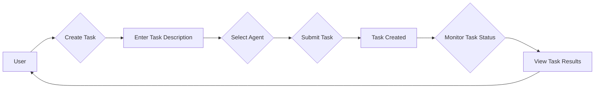
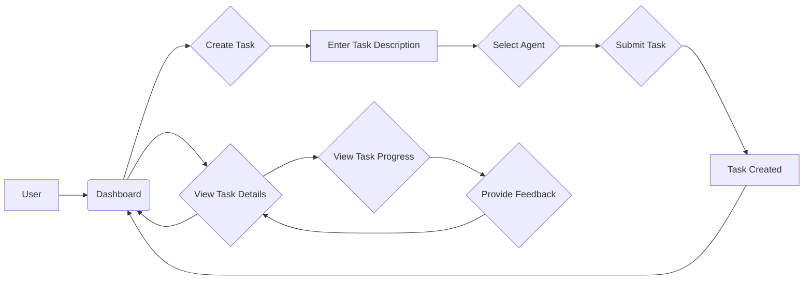

# UI/UX Design Specification Document: TaskMaster AI

## Table of Contents - UI/UX Design Specification Document

- [UI/UX Design Specification Document: TaskMaster AI](#uiux-design-specification-document-taskmaster-ai)
  - [Table of Contents - UI/UX Design Specification Document](#table-of-contents---uiux-design-specification-document)
  - [1. Introduction](#1-introduction)
  - [2. Design Principles](#2-design-principles)
  - [3. User Flows](#3-user-flows)
    - [3.1. Task Management Flow (CLI)](#31-task-management-flow-cli)
    - [3.2.  Task Management Flow (Web UI - Future)](#32--task-management-flow-web-ui---future)
  - [4. Wireframes (HTML/CSS Mockups)](#4-wireframes-htmlcss-mockups)
    - [4.1. TaskMaster AI - Command Line Interface (CLI)](#41-taskmaster-ai---command-line-interface-cli)
    - [4.2. TaskMaster AI - Web UI (Future) - Task Dashboard](#42-taskmaster-ai---web-ui-future---task-dashboard)
    - [4.3. TaskMaster AI - Web UI (Future) - Task Details Page](#43-taskmaster-ai---web-ui-future---task-details-page)
    - [4.4. TaskMaster AI - Web UI (Future) - Agent Details Page](#44-taskmaster-ai---web-ui-future---agent-details-page)
    - [4.5. TaskMaster AI - Web UI (Future) - Workflow Designer](#45-taskmaster-ai---web-ui-future---workflow-designer)
  - [5. Accessibility Features](#5-accessibility-features)
  - [6. Conclusion](#6-conclusion)


## 1. Introduction

This document outlines the design principles, user flows, wireframes, and accessibility considerations for the user interface of TaskMaster AI.  The design is focused on creating a user-friendly and intuitive experience for both the initial command-line interface (CLI) and the future web-based UI.  It emphasizes consistency, accessibility, and a smooth transition between the two interfaces. 

## 2. Design Principles

* **Clarity and Simplicity:**  The interface should be straightforward and easy to understand, minimizing complexity and cognitive load for users. 
* **Consistency:** Maintain a consistent design language across all UI elements (buttons, menus, typography, spacing) to create a cohesive user experience. This consistency should extend to both the CLI and the web-based UI, ensuring a similar look and feel, command structure, and overall interaction style.
* **Accessibility:** Ensure that the interface is accessible to all users, including those with disabilities, adhering to WCAG 2.1 Level AA guidelines. 
* **Responsiveness (Web UI - Future):** The web-based UI will be responsive and adapt to different screen sizes and devices (mobile, tablet, desktop) to provide a seamless experience.
* **Progressive Enhancement:**  The web UI will be built with progressive enhancement in mind, so that it degrades gracefully for users with older browsers or limited JavaScript capabilities.
* **API-First Approach:** The design will prioritize an API-first approach, ensuring that the CLI and the web UI interact with the same backend services through APIs. This promotes consistency in functionality and simplifies the transition between the two interfaces.
* **User-Centered Design (Web UI - Future):** The web UI will be designed with a strong focus on user-centered principles, ensuring a clear information hierarchy, easy navigation, and a visually appealing aesthetic.  It will strive to provide the right information in the right place at the right time to support users in managing their tasks and interacting with the AI.  

## 3. User Flows

### 3.1. Task Management Flow (CLI)



**Explanation:**

The Task Management Flow (CLI) depicts the steps a standard user would take to create, assign, and monitor a task using the command-line interface.  

**Admin User Flow:** Administrators will have access to additional CLI commands, including those for managing agents and viewing system logs.

### 3.2.  Task Management Flow (Web UI - Future)



**Explanation:**

This flow represents the primary user journey through the Task Management system using the web-based user interface.  

**Note:**  The future web UI will provide a more visual and interactive experience, allowing users to easily create, manage, and monitor tasks.  The design will strive for a consistent experience with the CLI, mirroring the functionality and commands wherever possible. 

## 4. Wireframes (HTML/CSS Mockups)

### 4.1. TaskMaster AI - Command Line Interface (CLI)

-  **(No Mockup Required):**  The command-line interface does not require a visual mockup.  

### 4.2. TaskMaster AI - Web UI (Future) - Task Dashboard

- **Filename:** `dashboard.html` and `dashboard.css`

**dashboard.html:**

```html
<!DOCTYPE html>
<html>
<head>
  <title>TaskMaster AI - Dashboard</title>
  <link rel="stylesheet" href="dashboard.css">
</head>
<body>
  <header>
    <h1>TaskMaster AI</h1>
  </header>
  <main>
    <section id="task-list">
      <h2>Task List</h2>
      <ul>
        <li>Task 1 (NLP Agent - In Progress) - <button>View Details</button></li>
        <li>Task 2 (Technical Agent - Completed) - <button>View Details</button></li>
      </ul>
    </section>
    <section id="agents">
      <h2>Agents</h2>
      <ul>
        <li>NLP Agent (Status: Available)</li>
        <li>Technical Agent (Status: Busy)</li>
      </ul>
    </section>
    <section id="create-task">
      <h2>Create New Task</h2>
      <form>
        <label for="task-description">Task Description:</label>
        <input type="text" id="task-description" name="task-description">
        <label for="agent-select">Select Agent:</label>
        <select id="agent-select" name="agent-select">
          <option value="nlp">NLP Agent</option>
          <option value="technical">Technical Agent</option>
        </select>
        <button type="submit">Submit Task</button>
      </form>
    </section>
  </main>
  <footer>
    &copy; [Your Name] - TaskMaster AI
  </footer>
</body>
</html>
```

**dashboard.css:**

```css
/* Basic Styling */
body {
  font-family: 'Arial', sans-serif; /* Use a clear, readable font */
  margin: 0;
  background-color: #f9f9f9; /* Light grey background */
}

header {
  background-color: #0044cc; /* Primary Color */
  color: white;
  padding: 20px;
  text-align: center;
}

main {
  padding: 20px;
}

section {
  margin-bottom: 20px;
  background-color: white; /* White sections for contrast */
  border-radius: 8px; /* Rounded corners */
  padding: 20px;
  box-shadow: 0 2px 4px rgba(0, 0, 0, 0.1); /* Add subtle shadow */
}

h2 {
  margin-top: 0;
  color: #0044cc; /* Primary Color for headings */
}

ul {
  list-style-type: none;
  padding: 0;
}

li {
  padding: 10px;
  border-bottom: 1px solid #ddd;
  display: flex;
  justify-content: space-between; /* Align task name and button */
  align-items: center; /* Vertically center content */
}

button {
  background-color: #0088ff; /* Secondary Color */
  color: white;
  padding: 8px 12px;
  border: none;
  border-radius: 5px;
  cursor: pointer;
}

form {
  display: flex;
  flex-direction: column;
  gap: 10px;
}

label {
  margin-bottom: 5px;
}

input, select {
  padding: 8px;
  border: 1px solid #ddd;
  border-radius: 5px;
}
```

### 4.3. TaskMaster AI - Web UI (Future) - Task Details Page

- **Filename:** `task_details.html` and `task_details.css`

**task_details.html:**

```html
<!DOCTYPE html>
<html>
<head>
  <title>TaskMaster AI - Task Details</title>
  <link rel="stylesheet" href="task_details.css">
</head>
<body>
  <header>
    <h1>TaskMaster AI</h1>
  </header>
  <main>
    <section>
      <h2>Task Details</h2>
      <p><strong>Task ID:</strong> 1</p>
      <p><strong>Description:</strong> Summarize the meeting notes</p>
      <p><strong>Agent:</strong> NLP Agent</p>
      <p><strong>Status:</strong> In Progress</p>
      <p><strong>Input Data:</strong> [Display meeting notes]</p>
      <p><strong>Output Data:</strong> [Display summary of meeting notes]</p>
      <p><strong>Feedback:</strong> 
        <textarea placeholder="Add your feedback here"></textarea>
        <button>Submit Feedback</button>
      </p>
    </section>
  </main>
  <footer>
    &copy; [Your Name] - TaskMaster AI
  </footer>
</body>
</html>
```

**task_details.css:**

```css
/* Basic Styling */
body {
  font-family: 'Arial', sans-serif; /* Use a clear, readable font */
  margin: 0;
  background-color: #f9f9f9; /* Light grey background */
}

header {
  background-color: #0044cc; /* Primary Color */
  color: white;
  padding: 20px;
  text-align: center;
}

main {
  padding: 20px;
}

section {
  margin-bottom: 20px;
  background-color: white; /* White sections for contrast */
  border-radius: 8px; /* Rounded corners */
  padding: 20px;
  box-shadow: 0 2px 4px rgba(0, 0, 0, 0.1); /* Add subtle shadow */
}

h2 {
  margin-top: 0;
  color: #0044cc; /* Primary Color for headings */
}

p {
  margin-bottom: 10px;
}

strong {
  font-weight: bold;
}

textarea {
  width: 100%;
  padding: 10px;
  border: 1px solid #ddd;
  border-radius: 5px;
  resize: vertical;
}

button {
  background-color: #0088ff; /* Secondary Color */
  color: white;
  padding: 8px 12px;
  border: none;
  border-radius: 5px;
  cursor: pointer;
}
```

### 4.4. TaskMaster AI - Web UI (Future) - Agent Details Page

- **Filename:** `agent_details.html` and `agent_details.css`

**agent_details.html:**

```html
<!DOCTYPE html>
<html>
<head>
  <title>TaskMaster AI - Agent Details</title>
  <link rel="stylesheet" href="agent_details.css">
</head>
<body>
  <header>
    <h1>TaskMaster AI</h1>
  </header>
  <main>
    <section>
      <h2>Agent Details</h2>
      <p><strong>Agent ID:</strong> nlp_agent</p>
      <p><strong>Type:</strong> NLP Agent</p>
      <p><strong>Status:</strong> Available</p>
      <h3>Capabilities</h3>
      <ul>
        <li>Text Summarization</li>
        <li>Information Extraction</li>
        <li>Response Generation</li>
      </ul>
    </section>
  </main>
  <footer>
    &copy; [Your Name] - TaskMaster AI
  </footer>
</body>
</html>
```

**agent_details.css:**

```css
/* Basic Styling */
body {
  font-family: 'Arial', sans-serif; /* Use a clear, readable font */
  margin: 0;
  background-color: #f9f9f9; /* Light grey background */
}

header {
  background-color: #0044cc; /* Primary Color */
  color: white;
  padding: 20px;
  text-align: center;
}

main {
  padding: 20px;
}

section {
  margin-bottom: 20px;
  background-color: white; /* White sections for contrast */
  border-radius: 8px; /* Rounded corners */
  padding: 20px;
  box-shadow: 0 2px 4px rgba(0, 0, 0, 0.1); /* Add subtle shadow */
}

h2 {
  margin-top: 0;
  color: #0044cc; /* Primary Color for headings */
}

p {
  margin-bottom: 10px;
}

strong {
  font-weight: bold;
}

h3 {
  margin-top: 20px;
  color: #0044cc; /* Primary Color for subheadings */
}

ul {
  list-style-type: none;
  padding: 0;
}

li {
  padding: 5px;
}
```

### 4.5. TaskMaster AI - Web UI (Future) - Workflow Designer 

- **Filename:** `workflow_designer.html` and `workflow_designer.css`

**workflow_designer.html:**

```html
<!DOCTYPE html>
<html>
<head>
  <title>TaskMaster AI - Workflow Designer</title>
  <link rel="stylesheet" href="workflow_designer.css">
</head>
<body>
  <header>
    <h1>TaskMaster AI</h1>
  </header>
  <main>
    <section>
      <h2>Workflow Designer</h2>
      <div id="workflow-canvas">
        </div>
      <div id="task-list">
        <h2>Available Tasks</h2>
        <ul>
          <li>Task 1</li>
          <li>Task 2</li>
          <li>Task 3</li>
        </ul>
      </div>
    </section>
  </main>
  <footer>
    &copy; [Your Name] - TaskMaster AI
  </footer>
</body>
</html>
```

**workflow_designer.css:**

```css
/* Basic Styling */
body {
  font-family: 'Arial', sans-serif; /* Use a clear, readable font */
  margin: 0;
  background-color: #f9f9f9; /* Light grey background */
}

header {
  background-color: #0044cc; /* Primary Color */
  color: white;
  padding: 20px;
  text-align: center;
}

main {
  padding: 20px;
}

section {
  margin-bottom: 20px;
  background-color: white; /* White sections for contrast */
  border-radius: 8px; /* Rounded corners */
  padding: 20px;
  box-shadow: 0 2px 4px rgba(0, 0, 0, 0.1); /* Add subtle shadow */
}

h2 {
  margin-top: 0;
  color: #0044cc; /* Primary Color for headings */
}

#workflow-canvas {
  width: 60%;
  height: 400px;
  border: 1px solid #ddd;
  margin-bottom: 20px;
}

#task-list {
  width: 30%;
  height: 400px;
  border: 1px solid #ddd;
  float: right;
}

ul {
  list-style-type: none;
  padding: 0;
}

li {
  padding: 10px;
  border-bottom: 1px solid #ddd;
}
```

## 5. Accessibility Features

* **Keyboard Navigation:** Ensure all interactive elements (buttons, links, input fields) are accessible and navigable using the keyboard.
* **Screen Reader Support:** Provide clear ARIA labels for all interactive elements to make the UI accessible to screen reader users.
* **Color Contrast:**  Use color combinations that meet the WCAG 2.1 Level AA contrast requirements.
* **Font Choice:**  Select fonts that are easy to read and have good visual clarity. 
* **Font Size:**  Use a minimum font size of 16 pixels for body text, ensuring readability for all users. 

## 6. Conclusion

This document provides a foundation for the UI design of TaskMaster AI, focusing on user-friendliness, clarity, and accessibility.  The design is focused on creating a solid foundation for the initial command-line interface (CLI) and a visually appealing, interactive web UI for future development. 

The next steps will involve refining these mockups, conducting usability testing (initially with the developer), and gathering feedback to further iterate on the design. As the system evolves, the design will be adjusted to ensure an optimal user experience. 


