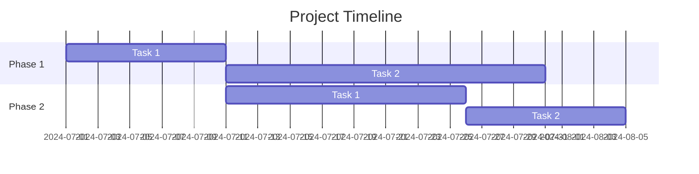
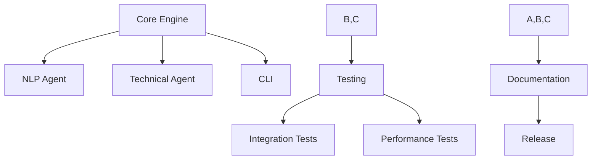

# Project Plan: TaskMaster AI

# Table of Contents

- [Project Plan: TaskMaster AI](#project-plan-taskmaster-ai)
- [Table of Contents](#table-of-contents)
  - [1. Introduction](#1-introduction)
  - [2. Phases and Milestones](#2-phases-and-milestones)
  - [3. Detailed Tasks (Core Functionality - Phase 1)](#3-detailed-tasks-core-functionality---phase-1)
    - [Core Engine](#core-engine)
    - [Agent Modules](#agent-modules)
    - [User Interface](#user-interface)
    - [Testing](#testing)
    - [Documentation](#documentation)
  - [4. Detailed Tasks (Expansion and Enhancement - Phase 2)](#4-detailed-tasks-expansion-and-enhancement---phase-2)
    - [Agent Modules](#agent-modules-1)
    - [Memory Management](#memory-management)
    - [Orchestrator](#orchestrator)
    - [User Interface (Potential)](#user-interface-potential)
    - [Testing](#testing-1)
    - [Documentation](#documentation-1)
  - [5. Managing Tasks and Timelines](#5-managing-tasks-and-timelines)
  - [6. Resources](#6-resources)
  - [7. Task Dependencies](#7-task-dependencies)
  - [8. Risk Management](#8-risk-management)
  - [9. Conclusion](#9-conclusion)

## 1. Introduction

This Project Plan outlines the tasks, milestones, timelines, and resources required for the development of TaskMaster AI. It considers the project's scope, functional and non-functional requirements, design specifications, and the development constraints of a solo developer with limited time and resources. The developer has 10 hours per week to dedicate to this project. The plan prioritizes delivering a functional core system (MVP) initially, with a roadmap for future expansion and enhancements. The project will follow an iterative development process, allowing for flexibility and adaptation as progress unfolds.

## 2. Phases and Milestones

**Phase 1: Core Functionality (MVP)**

- **Tasks:**
    - Implement the Core Engine (including Task Manager, Agent Coordinator, Memory Manager, and basic Orchestrator).
    - Develop the NLP Agent (Text Summarization, Information Extraction, Response Generation).
    - Develop the Technical Agent (Code Generation, Basic Debugging).
    - Create a basic command-line interface (CLI) for user interaction.
    - Establish the initial test framework (unit tests and basic integration tests).
    - Write initial documentation (API reference, user guide, and developer guide).
- **Milestone:** Minimum Viable Product (MVP)
- **Timeline:** 6 weeks

**Phase 2: Expansion and Enhancement**

- **Tasks:**
    - Incorporate more advanced NLP and Technical agent capabilities (e.g., sentiment analysis, code style analysis, question answering).
    - Implement more robust memory management (potentially using Redis for short-term memory).
    - Enhance the Orchestrator to manage more complex workflows and dependencies.
    - Explore a basic web UI (if time permits).
    - Conduct further testing, including integration tests and potentially some BDD scenarios.
    - Expand the documentation.
- **Milestone:** Expanded Functionality Release
- **Timeline:** 4 weeks

**Phase 3: Scalability and Advanced Features (6-12 Months)**

- **Tasks:**
    - Implement advanced features, including:
        - Planning and Reflection agents (inspired by AutoGen, Crew AI, Lumos, and AgentOS).
        - Teachable agents (inspired by AutoGen).
        - Tool integration (inspired by AutoGen, Crew AI, Lumos).
        - Code execution (inspired by AutoGen, Crew AI, Lumos).
        - Human proxy agents (inspired by AutoGen, CrewAI).
        - AgentEval framework (inspired by AutoGen, Lumos).
        - Workflow Designer (web UI).
    - Migrate to a microservices architecture if needed.
    - Explore cloud deployment for scalability and performance.
    - Implement a continuous integration/continuous delivery (CI/CD) pipeline.

**Phase 4: Continuous Improvement (Ongoing)**

- **Tasks:**
    - Gather user feedback.
    - Prioritize and implement feature enhancements based on feedback.
    - Continue to optimize system performance, scalability, and security.
    - Explore integration with new AI technologies and tools.
    - Expand documentation.

## 3. Detailed Tasks (Core Functionality - Phase 1)

### Core Engine

- **`core/coordinator.py`:** Manages the overall system coordination, task execution, and agent delegation.
- **`core/agent_factory.py`:** Develops the `AgentFactory` class to create and initialize agent instances.
- **`core/memory_manager.py`:** Implements the `ShortTermMemory` class (using `functools.lru_cache`) and the `LongTermMemory` class using SQLite. Also, implements purging logic for the long-term memory.
- **`core/orchestrator_interface.py`:** Defines the interface for interacting with the Orchestrator.
- **`core/error_handler.py`:** Implements a robust error handling mechanism, including logging.

### Agent Modules

- **`agents/specialized/nlp_agent.py`:** Implements the core functionalities of the NLP agent, including text summarization, information extraction, and response generation. Sentiment analysis will be implemented after text summarization.
- **`agents/specialized/technical_agent.py`:** Implements the Technical Agent's core functionalities (code generation, basic debugging, documentation creation). It may consider adding features like code style analysis, test case generation, and code completion in future iterations.

### User Interface

- **`interfaces/cli_interface.py`:** Develops the command-line interface (CLI) using libraries like `argparse`. Conduct user feedback sessions every two weeks.

### Testing

- **`tests/unit/test_core.py`:** Write unit tests for the Core Engine. Run unit tests daily.
- **`tests/unit/test_agents.py`:** Write unit tests for agent modules.
- **`tests/integration/test_workflows.py`:** Write basic integration tests for task dependencies and workflow execution. Run integration tests weekly.
- **`tests/performance/test_benchmarks.py`:** Develop tests to evaluate performance and benchmark response times.

### Documentation

- **`docs/api_reference.md`:** Create API documentation.
- **`docs/user_guide.md`:** Create a user guide for the CLI.
- **`docs/developer_guide.md`:** Create a developer guide with instructions on the project structure and how to contribute. Update documentation after each major feature implementation.

## 4. Detailed Tasks (Expansion and Enhancement - Phase 2)

### Agent Modules

- **`agents/specialized/nlp_agent.py`:**
    - Implement sentiment analysis, intent classification, and question answering features.
- **`agents/specialized/technical_agent.py`:**
    - Implement code style analysis.

### Memory Management

- **`memory/memory_manager.py`:**
    - Consider using Redis for short-term memory (if performance bottlenecks occur).
    - Refine the purging logic for the long-term memory to ensure efficient storage.

### Orchestrator

- **`orchestration/workflow_manager.py`:**
    - Enhance the workflow management to support more complex task dependencies.

### User Interface (Potential)

- **`interfaces/web_interface.py`:**
    - Explore the development of a basic web-based UI.

### Testing

- **`tests/integration/test_workflows.py`:** Expand integration tests to cover more complex workflows.
- **`tests/performance/test_benchmarks.py`:** Continue performance testing.
- **`tests/bdd/features/...`:** Implement BDD scenarios for key user workflows (if time permits).

### Documentation

- Expand all documentation (API reference, user guide, developer guide).

## 5. Managing Tasks and Timelines

**Task Management Tools:**

- **Markdown Todo:** Use Markdown Todo to manage tasks and deadlines within Markdown files. This provides a simple, intuitive approach for tracking progress, especially in VSCode.
- **Dendron:** Utilize Dendron's hierarchical note-taking system to organize tasks and project phases, creating a clear structure for your project plan.
- **Mermaid:** Employ Mermaid to create visual representations of tasks, dependencies, and timelines within your Markdown files.

**Example Project Structure:**

```
project/
├── project.md
├── phase1/
│   ├── phase1.md
│   ├── task1.md
│   └── task2.md
└── phase2/
    ├── phase2.md
    ├── task1.md
    └── task2.md
```

**Example Project.md:**

```markdown
# Project Plan

## Overview

This project aims to develop an AI agent framework for automating tasks and streamlining workflows.

## Phases

- [ ] **Phase 1:** Core Functionality (MVP)
    - [ ] Task 1: Implement the Core Engine
    - [ ] Task 2: Develop the NLP Agent
    - [ ] Task 3: Develop the Technical Agent
    - [ ] Task 4: Create a basic command-line interface
    - [ ] Task 5: Establish initial testing (unit and integration).
    - [ ] Task 6: Write initial documentation
- [ ] **Phase 2:** Expansion and Enhancement
    - [ ] Task 1: Incorporate advanced agent capabilities.
    - [ ] Task 2: Enhance memory management.
    - [ ] Task 3: Improve workflow management.
    - [ ] Task 4: Develop a basic web UI (optional).
    - [ ] Task 5: Conduct more extensive testing.
    - [ ] Task 6: Expand documentation.

## Gantt Chart



**Dependency Graph:**



**Estimating Task Durations:**

- **Historical Data:** If you have experience with similar projects, use that data to estimate task durations.
- **Expert Judgment:** Consult with other developers or team members with expertise to get their estimates.
- **Analogous Estimation:** Compare tasks to similar tasks in past projects and use those durations as a guide.

**Adjusting Timelines:**

- **Regular Reviews:** Conduct regular reviews of your progress to see how actual durations compare to estimates.
- **Buffer Time:** Include a buffer for unexpected delays or unforeseen challenges.
- **Critical Path:** Identify the critical path (the longest sequence of dependent tasks) to focus on tasks that directly impact the project's timeline.

## 6. Resources

* **Development Team:**
    - [Your Name] - Solo Developer
* **Technology:** [Refer to the Technical Stack Document: `tech_stack.md`](../technical/tech_stack.md).

## 7. Task Dependencies

- The development of the Core Engine and Agent Modules (NLP and Technical) are essential prerequisites for the development of other features and testing.
- The development of the user interface (CLI and future Web UI) will be dependent on the completion of the core backend components.
- Testing is a continuous process and will be conducted alongside development.

## 8. Risk Management

| **Risk**                                                | **Likelihood** | **Impact** | **Mitigation Strategy**                                                                                                                                                  |
|------------------------------------------------------|----------------|------------|--------------------------------------------------------------------------------------------------------------------------------------------------------------------------|
| **Limited Development Time and Resources**            |  Medium        | High      | Prioritize essential features, leverage open-source tools, and adopt a flexible and iterative development approach. Regularly reassess priorities based on available time and energy. |
| **Lack of Coding Experience**                           |  High          | Medium     |  Focus on continuous learning, break down complex tasks, leverage available resources (documentation, tutorials, community support), and seek assistance when needed.                  |
| **Mental Health Challenges**                           |  High          | High      |  Prioritize well-being, set realistic goals, take breaks, practice self-care, and seek support from mental health professionals when necessary. Adjust project timelines and workload as needed to prevent burnout. |
| **Reliance on Free AI Models and APIs**               |  Medium        | Medium     |  Carefully evaluate the capabilities and limitations of free AI models. Develop fallback strategies or consider using more robust paid services if free models prove insufficient for certain tasks. |
| **Potential Legal and Ethical Issues (Web Scraping, Licensing)** |  Medium        | High      |  Thoroughly research and comply with all relevant licensing agreements for open-source AI models. Ensure compliance with data privacy regulations when web scraping. Prioritize ethical data usage and model selection. |
| **Complexity of Multi-Agent Framework and Workflow Management**  |  High          | High      | Break down complex tasks into smaller, manageable units.  Use a modular design, clear documentation, and iterative development to handle the complexity. |
| **Unexpected Technical Challenges:**                    |  Medium        | High      |  Allocate a buffer in the timeline, research potential solutions, and involve the community or seek help from experienced developers if needed. |

**Regular Reviews:** Review and update the risk management plan monthly.

## 9. Conclusion

This Project Plan provides a roadmap for the development of TaskMaster AI, balancing the need for immediate functionality with a long-term vision for advanced features and scalability. The plan focuses on iterative development and utilizes tools like Markdown Todo, Dendron, and Mermaid for effective task management and communication. The next step will be to schedule a review meeting to finalize the project plan.
